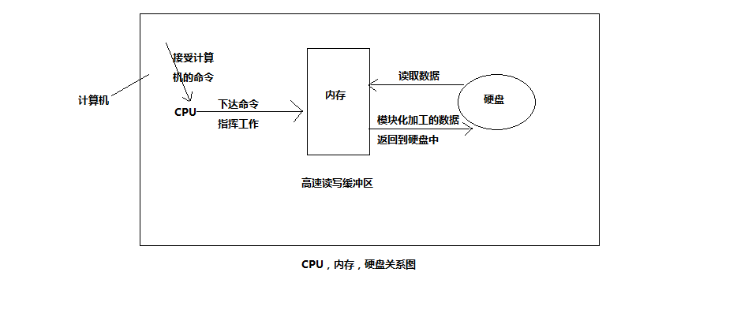

# 计算机基本概念

## 硬件与软件

计算机包括硬件（hardware）和软件（software）两个部分。

- 硬件：计算机中可以看见的物理部分。
- 软件：看不见的指令，这些指令可以控制硬件完成特定的任务。

如果将计算机比喻成人类，硬件就是人的肉体，而软件便视人的思想与灵魂。

### 计算机的硬件

- 中央处理器（CPU）
- 内存（主存）
- 存储设备：硬盘、光盘、磁材、软盘
- 输入设备：键盘、鼠标
- 输出设备：显示器、打印机
- 通信设备：调制解调器（Modem）、网卡

#### 冯诺依曼体系结构


- 中央处理器（Central Processing Unit,CPU）：计算机的大脑，它能从内存中获取指令，然后执行这些指令。中央处理器由两部分构成：运算器、控制器。
  
  - 运算器（即算数/逻辑单元 arithmetic/login unit：完成数值运算（加减乘除）和逻辑运算（比较）。
  - 控制单元：用于控制和协调其他组件的动作。
  - 每台计算机都有一个内部时钟，该时钟以固定的速度发射电子脉冲。时钟速度越快，给定时间内执行的指令就越多。速度的计量单位为**赫兹（Hz）**，1赫兹相当于每秒一个脉冲。随着CPU运算能力的不断提高，目前使用**千兆赫（GHz）**来表述。
  - 最初的CPU只有一个核（core）。核是计算机中实现指令读取和执行的部分。一个多核处理器拥有两个以上的核，可提高cpu的处理能力。

- 存储设备：主要包括，磁盘驱动器（硬盘）、光盘驱动器（CD、DVD），USB闪存驱动器（U盘）等。

- 内存（Ramdom-Access Memory，RAM）：由一个有序字节数列组成，用于存储程序及程序需要的数据。
  
  - 一个程序和它的数据在被CPU执行前必须移到计算机的内存中。

- 每个字节都有一个唯一的地址，以便于存储和获取数据。
  
  - 一个计算机具有的RAM越多，它的运行速度越快，但此规律只有在内存空间即将不够时有效。

- 内存和CPU一样，也构建在表面嵌有数百万晶体管的半导体芯片上。但内存芯片更简单、低速且便宜。

- 输入设备：键盘、鼠标

- 输出设备：显示器、打印机

#### 比特和字节

比特（bit）：计算机就是一系列的电路开关，每个开关存在两种状态：开（ON）、关（OFF）。如果电路是开的，它就是1，如果是关的，它就是。**一个0或者1存储为1个比特，比特是计算机中最小的存储单位。**

字节（byte）：**计算机中最基本的存储单元。每个字节又8个比特构成。**

计算机的存储能力通常是以字节和多字节来衡量的，比如：

- 千字节（kilobyte，KB）=1024B（byte）
- 兆字节（megabyte，MB）=1024KB
- 千兆字节（gigabyte，GB）=1024MB
- 万亿字节（terabyte，TB）=1024GB

注：10月24日是程序员节，**福利较好的公司**会在该日雇用程序员鼓励师为程序员提供服务。

#### 为什么我们需要内存？

实测发现：内存的存取速度比硬盘的存取速度快10倍以上，而cpu的数据处理速度比内存的读取速度还要快的多。我们把硬盘的程序放在内存让CPU运行，比直接让CPU在内存运行程序要快得多。所以**内存可以一定程度改善CPU运算过快，而硬盘又读写过慢的问题。**

内存与硬盘之间的关系：



内存起到两个作用：

1. 保存从硬盘读取的数据，提供给CPU使用。
2. 保存CPU的一些临时执行结果，以便CPU下次使用或存储到硬盘。

使用内存我们需要注意：

1. 内存是带电存储的，一旦断电数据就会消失。
2. 内存容量有限且珍贵。
3. 内存的存取速度难以提高，反而使用固态硬盘（SSD）可以极大改善硬盘的读写速度。

#### 计算机行业发展定律

**摩尔定律**

摩尔定律（Moore's Law）是英特尔创始人之一戈登·摩尔的经验之谈，其核心内容为：集成电路上可以容纳的晶体管数目在大约每经过18个月便会增加一倍。换言之，处理器的性能每隔两年翻一倍。 

摩尔定律是内行人摩尔的经验之谈，汉译名为“定律”，但并非自然科学定律，它一定程度揭示了信息技术进步的速度。 

**反摩尔定律**

反摩尔定律是Google的前CEO埃里克·施密特提出的：如果你反过来看摩尔定律，一个IT公司如果今天和18个月前卖掉同样多的、同样的产品，它的营业额就要降一半。IT界把它称为反摩尔定律。

反摩尔定律对于所有的IT公司来讲，都是非常可怕的，因为一个IT公司花了同样的劳动，却只得到以前一半的收入。反摩尔定律逼着所有的硬件设备公司必须赶上摩尔定律所规定的更新速度，而所有的硬件和设备生产厂活得都是非常辛苦的。

**安迪比尔定律**

安迪-比尔定理 （Andy and Bill’s Law）是对IT产业中软件和硬件升级换代关系的一个概括。原话是 “Andy gives, Bill takes away.（安迪提供什么，比尔拿走什么。）” 安迪指英特尔前CEO安迪·格鲁夫，比尔指微软前任CEO比尔·盖茨，这句话的意思是，硬件提高的性能，很快被软件消耗掉了。

#### 计算机发展史上的大佬们

##### 艾伦·麦席森·图灵

艾伦·麦席森·图灵（英语：Alan Mathison Turing，1912年6月23日—1954年6月7日），英国数学家、逻辑学家，被称为计算机科学之父，人工智能之父。1931年图灵进入剑桥大学国王学院，毕业后到美国普林斯顿大学攻读博士学位，第二次世界大战爆发后回到剑桥，后曾协助军方破解德国的著名密码系统Enigma，帮助盟军取得了二战的胜利。

1952年，英国政府对图灵的同性恋取向定罪，随后图灵接受化学阉割*（雌激素注射）*。1954年6月7日，图灵吃下含有氰化物的苹果中毒身亡，享年41岁。2013年12月24日，在英国司法大臣克里斯·格雷灵的要求下，英国女王伊丽莎白二世向图灵颁发了皇家赦免。

图灵对于人工智能的发展有诸多贡献，提出了一种用于判定机器是否具有智能的试验方法，即图灵试验，至今，每年都有试验的比赛。此外，图灵提出的著名的图灵机模型为现代计算机的逻辑工作方式奠定了基础。

##### 约翰·冯·诺依曼

冯·诺依曼（John von Neumann，1903年12月28日-1957年2月8日），美籍匈牙利数学家、计算机科学家、物理学家，是20世纪最重要的数学家之一。 冯·诺依曼是罗兰大学数学博士，是现代计算机、博弈论、哔哔弹等领域内的科学全才之一，被后人称为“现代计算机之父”、“博弈论之父”。 

冯·诺依曼先后执教于柏林大学和汉堡大学，1930年前往美国，后入美国籍。 历任普林斯顿大学教授、普林斯顿高等研究院教授，入选美国原子能委员会会员、美国国家科学院院士。 早期以算子理论、共振论、量子理论、集合论等方面的研究闻名，开创了冯·诺依曼代数。 冯·诺依曼第二次世界大战期间曾参与曼哈顿计划，为第一颗哔哔弹的研制作出了贡献。 

冯·诺依曼1944年与奥斯卡·摩根斯特恩合著《博弈论与经济行为》，是博弈论学科的奠基性著作。晚年，冯·诺依曼转向研究自动机理论，著有对人脑和计算机系统进行精确分析的著作《计算机与人脑》（1958年），为研制电子数字计算机提供了基础性的方案。 其余主要著作有《量子力学的数学基础》（1926）、《经典力学的算子方法》、《连续几何》（1960）等。 

### 计算机的软件

软件，及一些列按照特定顺序组织的计算机数据和指令的集合。有系统软件和应用软件之分。

#### 人机交互方式

图形化界面（Graphical User Interface，GUI），这种方式简单直观，使用者易于接受，容易上手操作。

命令行方式（Command Line Interface，CLI），需要有一个控制台，输入特定的指令，让计算机完成一些操作。较为麻烦，需要记住指令。

最早的图形化界面是由施乐公司研发的，苹果抄袭（借鉴）了施乐，微软又抄袭（借鉴）了苹果。

#### 常用DOS命令

- dir：列出当前目录下的文件或文件夹
- md：创建目录
- rd：删除目录
- cd：进入指定目录
- cd..：退回到上一级目录
- del：删除文件
- exit：退出dos命令行

#### 编程语言介绍

第一代语言：机器语言，以二进制形式存在

第二代语言：汇编语言，使用助记符表示一条机器指令

```
graph LR
a(汇编语言) -->  b[汇编器]-->c(机器代码文件)
```

第三代语言：高级语言

1. C、Pascal、Fortran等面向过程编程语言
2. C++兼具面向过程与面向对象
3. JAVA面向对象
4. .NET跨平台语言
5. Python、Scala...

#### 软件的应用场景

除了个人计算机，飞机、汽车、手机、甚至烤面包机中都在运行着程序。

### 操作系统

操作（Operating System）系统是运行在计算机上的最重要的程序，它可以管理和操作计算机的活动。

它可以：

- 控制和监视系统的活动
- 分配和调配系统资源
- 调度操作

### 万维网

万维网WWW是World Wide Web的简称，也称为Web、3W等。WWW是基于客户机/服务器方式的信息发现技术和超文本技术的综合。WWW服务器通过超文本标记语言(HTML)把信息组织成为图文并茂的超文本，利用链接从一个站点跳到另个站点。这样一来彻底摆脱了以前查询工具只能按特定路径一步步地查找信息的限制 。
