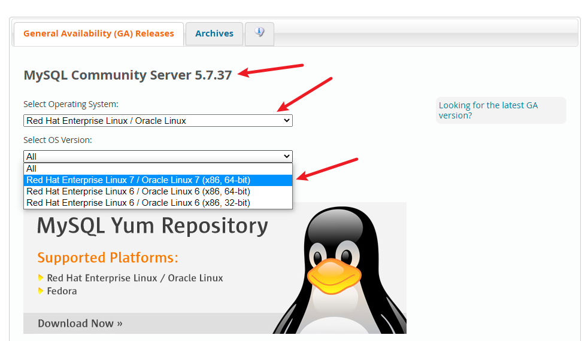
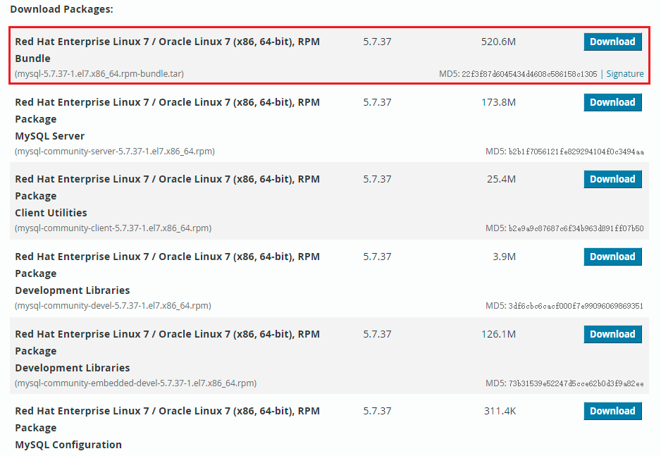
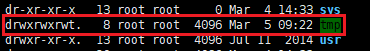

## 安装mysql

### 检查是否安装过mysql

如果你是用rpm安装, 检查一下RPM PACKAGE：

```shell
$ rpm -qa | grep -i mysql # -i 忽略大小写
```

检查mysql service：

```shell
$ systemctl status mysqld.service
```

### 确认版本及架构

确认服务器版本及架构，通常有x86_64架构及arm架构

```shell
$ cat /etc/redhat-release 
CentOS Linux release 7.1.1503 (Core)
$ uname -m
x86_64
```

可知使用的是centOs7及x86架构。

### 下载

下载页面：[https://dev.mysql.com/downloads/mysql/](https://dev.mysql.com/downloads/mysql/)

根据自己的操作系统版本及架构，还有要下载的mysql版本，筛选合适的安装包。



centOs没有对应版本，下载使用Red Hat版本。选择版本号及架构。（可以看到5.7没有arm架构，但8.0是有的）

可下载的版本比较多，这里选择最上面的Bundle版本，这是一个全量包，包含所有组件。也可以按需一个个下载。



### 环境检查

检查 `/tmp` 临时目录权限。由于mysql安装过程中，会通过mysql用户在 `/tmp` 目录下新建tmp_db文件，所以请给 `/tmp` 较大的权限。



执行以下命令给予最大权限：

```shell
$ chmod -R 777 /tmp
```

### 检查依赖

```shell
# libaio,异步io接口
$ rpm -qa|grep libaio
libaio-0.3.109-13.el7.x86_64
$ rpm -qa|grep net-tools
net-tools-2.0-0.17.20131004git.el7.x86_64
```

如果缺少哪个依赖需要手动安装：

```shell
$ yum install [包名]
```

### 解压Bundle包

进入mysql tar文件所在的文件夹

```shell
$ tar -xvf mysql-5.7.37-1.el7.x86_64.rpm-bundle.tar -C /opt
mysql-community-client-5.7.37-1.el7.x86_64.rpm
mysql-community-common-5.7.37-1.el7.x86_64.rpm
mysql-community-devel-5.7.37-1.el7.x86_64.rpm
mysql-community-embedded-5.7.37-1.el7.x86_64.rpm
mysql-community-embedded-compat-5.7.37-1.el7.x86_64.rpm
mysql-community-embedded-devel-5.7.37-1.el7.x86_64.rpm
mysql-community-libs-5.7.37-1.el7.x86_64.rpm
mysql-community-libs-compat-5.7.37-1.el7.x86_64.rpm
mysql-community-server-5.7.37-1.el7.x86_64.rpm
mysql-community-test-5.7.37-1.el7.x86_64.rpm
```

### 安装

mysql5.7安装下面这些包：

```shell
$ rpm -ivh mysql-community-common-5.7.37-1.el7.x86_64.rpm
$ rpm -ivh mysql-community-libs-5.7.37-1.el7.x86_64.rpm
$ rpm -ivh mysql-community-client-5.7.37-1.el7.x86_64.rpm
$ rpm -ivh mysql-community-server-5.7.37-1.el7.x86_64.rpm
```

如果是mysql8.0安装下面这些包：

```shell
$ rpm -ivh mysql-community-common-8.0.25-1.el7.x86_64.rpm
$ rpm -ivh mysql-community-client-plugins-8.0.25-1.el7.x86_64.rpm
$ rpm -ivh mysql-community-libs-8.0.25-1.el7.x86_64.rpm
$ rpm -ivh mysql-community-client-8.0.25-1.el7.x86_64.rpm
$ rpm -ivh mysql-community-server-8.0.25-1.el7.x86_64.rpm
```

**安装是有顺序要求的**，顺序不对会有缺少依赖的报错。

::: tip

安装 `mysql-community-libs` 时可能会出现以下情形：

```shell
$ rpm -ivh mysql-community-libs-5.7.37-1.el7.x86_64.rpm
warning: mysql-community-libs-5.7.37-1.el7.x86_64.rpm: Header V4 RSA/SHA256 Signature, key ID 3a79bd29: NOKEY
error: Failed dependencies:
	mariadb-libs is obsoleted by mysql-community-libs-5.7.37-1.el7.x86_64
```

我们需要删除mariadb提供的mysql-libs：

```shell
$ yum remove mysql-libs
```

再次安装即可。

:::

执行如下命令，查看是否安装成功。需要增加 -i 不用去区分大小写，否则搜索不到。

```shell
$ rpm -qa|grep -i mysql
mysql-community-libs-5.7.37-1.el7.x86_64
mysql-community-common-5.7.37-1.el7.x86_64
mysql-community-server-5.7.37-1.el7.x86_64
mysql-community-client-5.7.37-1.el7.x86_64
```

检查mysql版本：

```shell
$ mysql --version
mysql  Ver 14.14 Distrib 5.7.37, for Linux (x86_64) using  EditLine wrapper
```

### 初始化

为了保证数据库目录与文件的所有者为 mysql 登录用户，如果你是以 root 身份运行 mysql 服务，需要执 行下面的命令初始化： 

```shell
$ mysqld --initialize --user=mysql
```

::: tip

`--initialize` 选项默认以“安全”模式来初始化，则会为 root 用户生成一个密码并将 该密码标记为过 期 ，登录后你需要设置一个新的密码。生成的 临时密码 会往日志中记录一份。 

:::

查看密码：

```shell
$ cat /var/log/mysqld.log
2022-03-05T02:47:14.318262Z 0 [Warning] TIMESTAMP with implicit DEFAULT value is deprecated. Please use --explicit_defaults_for_timestamp server option (see documentation for more details).
2022-03-05T02:47:15.191190Z 0 [Warning] InnoDB: New log files created, LSN=45790
2022-03-05T02:47:15.267474Z 0 [Warning] InnoDB: Creating foreign key constraint system tables.
2022-03-05T02:47:15.327380Z 0 [Warning] No existing UUID has been found, so we assume that this is the first time that this server has been started. Generating a new UUID: 90caaf18-9c2e-11ec-bda3-525401e8e324.
2022-03-05T02:47:15.329557Z 0 [Warning] Gtid table is not ready to be used. Table 'mysql.gtid_executed' cannot be opened.
2022-03-05T02:47:16.882407Z 0 [Warning] A deprecated TLS version TLSv1 is enabled. Please use TLSv1.2 or higher.
2022-03-05T02:47:16.882428Z 0 [Warning] A deprecated TLS version TLSv1.1 is enabled. Please use TLSv1.2 or higher.
2022-03-05T02:47:16.883198Z 0 [Warning] CA certificate ca.pem is self signed.
2022-03-05T02:47:17.193470Z 1 [Note] A temporary password is generated for root@localhost: ,39%y.steT3q
```

`[Note] A temporary password is generated for root@localhost:` 后面的就是临时密码。

### 启动

```shell
# 加不加.service后缀都可以
# 启动
$ systemctl start mysqld.service
# 关闭：
$ systemctl stop mysqld.service
# 重启：
$ systemctl restart mysqld.service
#查看状态：
$ systemctl status mysqld.service
```

::: tip

mysqld 这个可执行文件就代表着 MySQL 服务器程序，运行这个可执行文件就可以直接启动一个 服务器进程。

:::

查看状态：

```shell
$ systemctl status mysqld.service
mysqld.service - MySQL Server
   Loaded: loaded (/usr/lib/systemd/system/mysqld.service; enabled)
   Active: active (running) since Sat 2022-03-05 11:06:25 CST; 7min ago
     Docs: man:mysqld(8)
           http://dev.mysql.com/doc/refman/en/using-systemd.html
 Main PID: 5305 (mysqld)
   CGroup: /system.slice/mysqld.service
           └─5305 /usr/sbin/mysqld --daemonize --pid-file=/var/run/mysqld/mysqld.pid

Mar 05 11:06:25 i-3oy5p5a0 systemd[1]: Started MySQL Server.
```

可以看到 `active (running)` 就是启动了。（控制台上它是绿色的，超级明显！）

查看进程：

```shell
$ ps -ef | grep -i mysql
mysql     5305     1  0 11:06 ?        00:00:00 /usr/sbin/mysqld --daemonize --pid-file=/var/run/mysqld/mysqld.pid
root      5390  5234  0 11:07 pts/0    00:00:00 grep --color=auto -i mysql
```

### 检查开机自启动

安装检查是不是开机自启动。（默认是enabled。）

```shell
$ systemctl list-unit-files|grep mysqld.service
mysqld.service                              enabled
```

设置mysql为自启动：

```shell
$ systemctl enable mysqld.service
```

取消开机自启动：

```shell
$ systemctl disable mysqld.service
```

### 登录

通过 `mysql -hlocalhost -P3306 -uroot -p` 进行登录，在 `Enter password：` 后录入初始化密码。

```shell
$ mysql -hlocalhost -P3306 -uroot -p
Enter password: 
Welcome to the MySQL monitor.  Commands end with ; or \g.
Your MySQL connection id is 2
Server version: 5.7.37

Copyright (c) 2000, 2022, Oracle and/or its affiliates.

Oracle is a registered trademark of Oracle Corporation and/or its
affiliates. Other names may be trademarks of their respective
owners.

Type 'help;' or '\h' for help. Type '\c' to clear the current input statement.

mysql> 
```

可喜可贺。:tada:

### 修改密码

如果我们使用临时密码登陆后不修改登录密码，会发现什么也干不了。像下面这样：

```shell
mysql> show databases;
ERROR 1820 (HY000): You must reset your password using ALTER USER statement before executing this statement.
```

修改密码：

```shell
ALTER USER 'root'@'localhost' IDENTIFIED BY 'new_password';
```

::: tip

5.7版本之后（不含5.7），mysql加入了全新的密码安全机制。设置新密码太简单会报错。

:::

修改完密码后就可以正常使用了。可以退出用新密码登录试试。

### 补充

#### mysql的默认目录

数据库目录：
`/var/lib/mysql/`

配置文件：
`/usr/share/mysql`（mysql.server命令及配置文件）
`/etc/my.cnf`

相关命令：
`/usr/bin`(mysqladmin mysqldump等命令)

启动脚本
`/etc/rc.d/init.d/`（启动脚本文件mysql的目录）


#### 关于用户端口限制

通过 `mysql` 逻辑库中的usr表配置用户的ip限制，root的默认的 `Host` 是localhost。此时是无法通过网络访问到数据库的。

举例，将root用户设置为任何ip可登录：

```sql
mysql> use mysql;
mysql> update user set Host = '%' where User = 'root';
mysql> flush privileges;
```


#### 可能需要修改的配置

mysql的配置文件一般位于: /etc/my.cnf

```c
# 使查询语句大小写不敏感
lower_case_table_names=1
```


