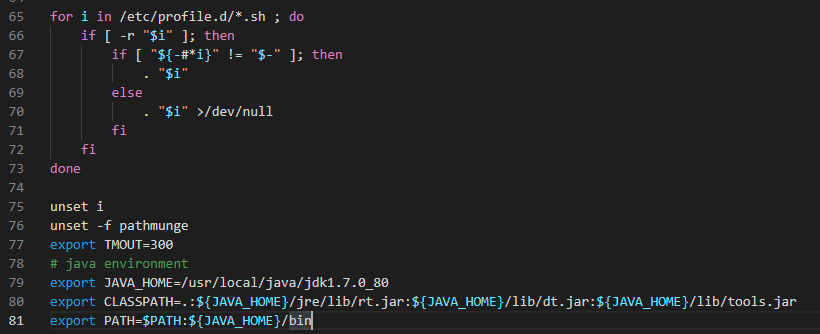

# JDK

## 安装JDK

### 下载

当前最新版本下载地址：

[http://www.oracle.com/technetwork/java/javase/downloads/index.html](http://www.oracle.com/technetwork/java/javase/downloads/index.html)

历史版本下载地址：　　

[https://www.oracle.com/java/technologies/downloads/archive/](https://www.oracle.com/java/technologies/downloads/archive/)

可下载rpm安装包与tar.gz压缩包，我在这里**选择使用tar.gz**。

### 解压

```shell
$ tar -zxvf jdk-7u80-linux-x64.tar.gz -C /usr/local/
```

:::warning

一定需要通过压缩包解压，而不是直接将解压过的文件夹复制过来，否则bin下的文件会没有可执行权限。

:::

### 配置环境变量

在 `/etc/profile` 进行环境变量配置，我这里使用Xftp工具打开，直接用vscode进行编辑的。

编写位置在文件最下方，应在 `unset -f pathmunge` 之下。

```shell
# java environment
export JAVA_HOME=/usr/local/java/jdk1.7.0_80
export CLASSPATH=.:${JAVA_HOME}/jre/lib/rt.jar:${JAVA_HOME}/lib/dt.jar:${JAVA_HOME}/lib/tools.jar
export PATH=$PATH:${JAVA_HOME}/bin
```

配置完毕后是这个样子：



（`export TMOUT=300` 是我的服务器自带的，我看别人的好像没有）

编辑完毕，使用 `source /etc/profile` 命令使配置文件生效。

### 验证

正确的显示应如下：

```shell
$ java -version
java version "1.7.0_80"
Java(TM) SE Runtime Environment (build 1.7.0_80-b15)
Java HotSpot(TM) 64-Bit Server VM (build 24.80-b11, mixed mode)
```

