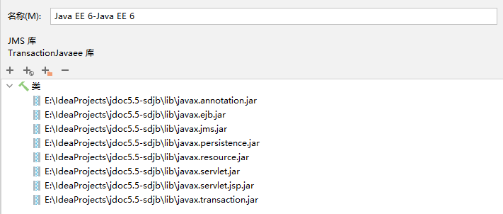

# 远古java EE项目启动异常及解决办法 


### idea启动tomcat应用，卡在 `Deployment of web application directory` 不动了

```
三月 11, 2022 10:56:05 上午 org.apache.catalina.startup.HostConfig deployDirectory
信息: Deployment of web application directory [D:\apache-tomcat-7.0.99\webapps\manager] has finished in [557] ms
```

检查 tomcat文件夹， bin 目录下 catalina.bat 文件。可能增加了 `JAVA_OPTS` 配置。注释掉即可。

修改前为：

```bat
set JAVA_OPTS=-Xms1024m -Xmx4096m -XX:PermSize=128m -XX:MaxPermSize=256m
```

注释掉之后为：

```bat
@REM set JAVA_OPTS=-Xms1024m -Xmx4096m -XX:PermSize=128m -XX:MaxPermSize=256m
```


### 提示找不到某个类，可lib已经正确引入了

原来的开发者可能并没有将对应的jar包放在应用的lib中，而是tomcat的lib中。我们需要知道自己的tomcat相比项目开发者的，少了些什么。我的做法是直接拷贝同事所使用的tomcat进行使用。


### `JasperException: xxxUnable to read TLD "META-INF/c.tld" from JAR file xxx`

`Java EE 6` 冲突引起的。idea 删除原有的 `Java EE 6` 依赖，这是运行时会报错显示缺少依赖，根据指引重新下载 `Java EE 6` 依赖，重新运行即可。




### 一个或多个listeners启动失败

```
11-Mar-2022 09:54:17.248 严重 [RMI TCP Connection(5)-127.0.0.1] org.apache.catalina.core.StandardContext.startInternal 一个或多个listeners启动失败，更多详细信息查看对应的容器日志文件
11-Mar-2022 09:54:17.251 严重 [RMI TCP Connection(5)-127.0.0.1] org.apache.catalina.core.StandardContext.startInternal 由于之前的错误，Context[]启动失败
```

又是因为tomcat的lib中缺少一些愚蠢的jar包。有程序员把项目的依赖直接丢在tomcat的lib中了。把启动这个项目成功过的tomcat中的jar粘贴进来即可。
