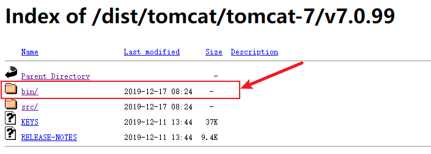

## Tomcat

Tomcat是apache提供的，针对java的定制服务器，实现了java ee最重要的两大项：severlet、jsp。

优点嘛，不要钱！也因此在java的历史上扮演了最重要的角色。

在springboot内置tomcat成为主流部署方式后，我们很少会在用到tomcat了。使用tomcat会导致一部分配置分散于项目之外。

### 为什么我们还要用它？

1. 老项目运维、老项目二开所产生的“新项目”。

2. 在同一个端口下运行多个项目，以tomcat部署，可以实现ip+端口+项目名的方式启动。而一个springboot app对应一个内置tomcat对应一个端口的方式无法实现。

3. 因为项目管理的要求需要对class文件进行增量部署（我认为这种方式是愚蠢的，它增加了各环境代码不一致的风险，将复杂繁琐的操作操作寄希望于人工小心谨慎处理，与自动化部署思维背道而驰）。

## 安装Tomcat

当前最新版本下载地址：

[https://tomcat.apache.org/](https://tomcat.apache.org/)

历史版本下载地址：

[https://archive.apache.org/dist/tomcat/](https://archive.apache.org/dist/tomcat/)

下载历史版本时，安装包在bin目录下：



下载以tar.gz为后缀的版本：


### 解压

```shell
$ tar -zxvf apache-tomcat-7.0.99.tar.gz -C /usr/local/
```

### 配置开机自启

在 `/etc/rc.d/rc.local` 文件最后加上：

```
export JAVA_HOME=/usr/local/java/jdk1.7.0_80
/usr/local/apache-tomcat-7.0.99/bin/startup.sh start
```

说明：

- `/usr/local/java/jdk1.7.0_80` 是jdk安装目录
- `/usr/local/apache-tomcat-7.0.99` 是tomcat安装的目录

修改rc.local文件为可执行

```shell
chmod +x  rc.local  
```

::: tip

重启服务器命令是 `reboot` 。

:::

完毕，撒花！:tada:

## 常改配置

### 修改 `URIEncoding`

在 `get` 请求进入我们的应用前，tomcat会根据 `URIEncoding` 对URI进行解码，默认字符编码是ISO-8859-1。这个不改会没法正常使用带中文的 `get` 请求。

修改 `server.xml` ：

```xml{4}
<Connector port="8080" protocol="HTTP/1.1"
               connectionTimeout="20000"
               redirectPort="8443"
               URIEncoding="UTF-8"/>
```

### 修改启动时的jvm配置

如果是windows系统，并且以bat文件启动，可以修改 `tomcat\bin\catalina.bat`

```shell{2}
setlocal
set JAVA_OPTS = -Xms256m -Xmx512m -XX:PermSize=128M -XX:MaxNewSize=256m -XX:MaxPermSize=256m
rem Suppress Terminate batch job on CTRL+C
```

### windows环境修改tomcat控制台字符编码

这个问题的原因是windows在中文环境中，cmd的默认编码集为GBK，与tomcat的字符编码不一致，所以导致乱码。所以tomcat的命令框和输出日志都是乱码。这是windows的锅，准确说和tomcat没什么关系，但为了不影响其它系统运行，相对于修改windows配置，最保守的解决办法是修改我们自己tomcat。

修改 `tomcat\conf\logging.properties` ：

```properties{3}
java.util.logging.ConsoleHandler.level = FINE
java.util.logging.ConsoleHandler.formatter = org.apache.juli.OneLineFormatter
java.util.logging.ConsoleHandler.encoding = GBK
```

据说在jvm参数增加 `-Dfile.encoding=UTF-8` 也是可以的。
