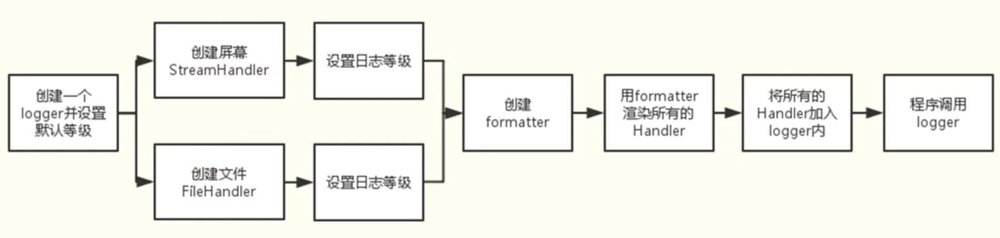

# logging


### logging？alright

logging是python的内置日志标准库，它很强大，以至于你不需要再考虑学习与使用第三方库。

日志是对软件执行时所发生事件的一种追踪方式。软件开发人员对他们的代码添加日志调用，借此来指示某事件的发生。一个事件通过一些包含变量数据的描述信息来描述（比如：每个事件发生时的数据都是不同的）。开发者还会区分事件的重要性，重要性也被称为 *等级* 或 *严重性*。

### 萌新教程

#### 日志级别

日志功能应以所追踪事件级别或严重性而定。各级别适用性如下（以严重性递增）：

| 级别       | 何时使用                                                     |
| :--------- | :----------------------------------------------------------- |
| `DEBUG`    | 细节信息，仅当诊断问题时适用。                               |
| `INFO`     | 确认程序按预期运行。                                         |
| `WARNING`  | 表明有已经或即将发生的意外（例如：磁盘空间不足）。程序仍按预期进行。 |
| `ERROR`    | 由于严重的问题，程序的某些功能已经不能正常执行               |
| `CRITICAL` | 严重的错误，表明程序已不能继续执行                           |

**默认的级别是 `WARNING`，意味着只会追踪该级别及以上的事件，除非更改日志配置。**

一个简单的例子：

```python
import logging

logging.debug('debug message')
logging.info('info message')
logging.warning('warn message')
logging.error('error message')
logging.critical('critical message')
```

运行结果：

```shell
WARNING:root:warn message
ERROR:root:error message
CRITICAL:root:critical message
```

而如果在输出日志前增加一行：

```python
logging.basicConfig(level=logging.DEBUG)
```

修改后是：

```python
import logging

logging.basicConfig(level=logging.DEBUG)
logging.debug('debug message')
logging.info('info message')
logging.warning('warn message')
logging.error('error message')
logging.critical('critical message')
```

运行结果变为：

```
DEBUG:root:debug message
INFO:root:info message
WARNING:root:warn message
ERROR:root:error message
CRITICAL:root:critical message
```


#### 记录日志到文件

所追踪事件可以以不同形式处理。最简单的方式是输出到控制台。另一种常用的方式是写入磁盘文件。

要实现输出到文件，通过 *filename* 参数即可：

```python
import logging

logging.basicConfig(filename='example.log', level=logging.DEBUG)
logging.debug('This message should go to the log file')
logging.info('So should this')
logging.warning('And this, too')
logging.error('And non-ASCII stuff, too, like Øresund and Malmö')
```

增加 *filename* 参数后，控制台不再输出，而本地多了`example.log`文件，文件内内容如下：

```
DEBUG:root:This message should go to the log file
INFO:root:So should this
WARNING:root:And this, too
ERROR:root:And non-ASCII stuff, too, like \xd8resund and Malm\xf6
```

这样我们就实现了将日志输出到文件。

一点小问题：很明显，最后一行出现了字符编码错误。在 python3.9 版后，增加了 *encoding* 参数以解决此问题。在更早的 Python 版本中或没有指定时，编码会用 [`open()`](https://docs.python.org/zh-cn/3/library/functions.html#open) 使用的默认值。


#### 日志の格式

可以通过 *format* 参数更改：

```python
import logging

logging.basicConfig(format="%(asctime)s|%(levelname)s|%(filename)s:%(lineno)d|%(message)s", level=logging.DEBUG)
logging.debug('This message should go to the log file')
logging.info('So should this')
logging.warning('And this, too')
logging.error('And non-ASCII stuff, too, like Øresund and Malmö')
```

运行结果：

```
2021-07-05 22:16:17,823|DEBUG|test 01.py:4|This message should go to the log file
2021-07-05 22:16:17,823|INFO|test 01.py:5|So should this
2021-07-05 22:16:17,823|WARNING|test 01.py:6|And this, too
2021-07-05 22:16:17,824|ERROR|test 01.py:7|And non-ASCII stuff, too, like Øresund and Malmö
```

请注意，前面示例中出现的 “root” 已消失。 对于可以出现在格式字符串中的全部内容，你可以参考以下文档 [LogRecord 属性](https://docs.python.org/zh-cn/3/library/logging.html#logrecord-attributes) 。

若要修改时间显示的格式，可以向 `basicConfig` 提供 *datefmt* 参数，比如：

```python
import logging
logging.basicConfig(format='%(asctime)s %(message)s', datefmt='%m/%d/%Y %I:%M:%S %p')
logging.warning('is when this event was logged.')
```

这会显示如下内容：

```
12/12/2010 11:46:36 AM is when this event was logged.
```

*datefmt* 参数的格式与 [`time.strftime()`](https://docs.python.org/zh-cn/3/library/time.html#time.strftime) 支持的格式相同。


#### 坏的做法

##### 混用logging和print

先来看一段代码：

```python
import logging

print('print message')
logging.basicConfig(level=logging.DEBUG)
logging.debug('debug message')
logging.info('info message')
logging.warning('warn message')
logging.error('error message')
logging.critical('critical message')
```

运行结果：

```shell
DEBUG:root:debug message
INFO:root:info message
WARNING:root:warn message
ERROR:root:error message
CRITICAL:root:critical message
print message
```

logging日志之间的先后顺序是确定的，然而print和logging的先后打印顺序却是不确定的，有时print更早，有时更晚。

因为日志系统为了不影响程序运行速度，是异步且并发的。

**建议print与logging不要同时使用**。


### 高级应用

现在，将刚才学到的代码都忘掉吧！我们不可能用那么麻烦的方式输出日志。

当然，如果你已将之前的知识掌握，那么概念与印象会留在脑海中一直帮助你学习后面的姿势。


日志库采用模块化方法，并提供几类组件：记录器、处理器、过滤器和格式器。

- 记录器（loggers）提供应用程序的调用接口。
- 处理器（handlers）将日志记录（由记录器创建）发送到适当的目标。
- 过滤器（filters）提供了更精细的附加功能，用于确定要输出的日志记录。
- 格式器（formatter）指定最终输出中日志记录的样式。




#### Logger

1. 提供应用程序的调用接口，公开了几种方法，以便应用程序可以在运行时记录消息。

   ```python
   # logger是单例的，我们通过名字获取了logger，或者如果没有则返回 root。
   logger = logging.getLogger(__name__)
   ```

2. 决定日志记录的级别。

   ```python
   # 指定记录器将处理的最低严重性日志消息
   logger.setLevel()
   ```
    例如，如果严重性级别为 INFO ，则记录器将仅处理 INFO 、 WARNING 、 ERROR 和 CRITICAL 消息，并将忽略 DEBUG 消息。

3. 将日志内容传递到相关联的handles。

   ```python
   # 从记录器对象中添加和删除处理器对象。
   logger.addHandler()
   logger.removeHandler()
   ```

**logger的名称**

默认为root

```python
logger = logging.getLogger()
print(logger)
print(type(logger))

'''
<RootLogger root (WARNING)>
<class 'logging.RootLogger'>
'''
```

当指定名字后：

```python
logger = logging.getLogger('damon')
print(logger)
print(type(logger))

'''
<Logger damon (WARNING)>
<class 'logging.Logger'>
'''
```

类型也发生了改变。


#### Handlers

它们将日志分发到不同的目的地。可以是文件、标准输出、邮件、或者通过socket、html等协议发送到任何地方。

最常用的handler主要有：

**StreamHandler**

标准输出stdout（如显示器）分发器。

```python
sh = logging.StreamHandler(Stream=None)
```

**FileHandler**

继承自StreamHandler，将日志保存到磁盘文件处理器。

```python
fh = logging.FileHandler(filename, mode='a', encoding=None, delay=False, errors=None)
```

当然，还有其他的，其中这两个是很好用的：

`RotatingFileHandler` 实例将消息发送到硬盘文件，支持最大日志文件大小和日志文件轮换。

`TimedRotatingFileHandler` 实例将消息发送到硬盘文件，以特定的时间间隔轮换日志文件。

#### Formatter

格式化器对象配置日志消息的最终顺序、结构和内容。

```python
ft = logging.Formatter.__init__(fmt=None, datefmt=None, style='%')
```

比如我们可以把格式设定为：

```
'%(asctime)s - %(levelname)s - %(message)s'
```

上面出现的特殊格式的属性为  *LogRecord*  ，以下有更多的 *LogRecord* 属性可以参考：

| 属性名称        | 格式                         | 描述                                                         |
| :-------------- | :--------------------------- | :----------------------------------------------------------- |
| args            | 此属性不需要用户进行格式化。 | 合并到 `msg` 以产生 `message` 的包含参数的元组，或是其中的值将被用于合并的字典（当只有一个参数且其类型为字典时）。 |
| asctime         | `%(asctime)s`                | 表示 [`LogRecord`](https://docs.python.org/zh-cn/3.9/library/logging.html#logging.LogRecord) 何时被创建的供人查看时间值。 默认形式为 '2003-07-08 16:49:45,896' （逗号之后的数字为时间的毫秒部分）。 |
| created         | `%(created)f`                | [`LogRecord`](https://docs.python.org/zh-cn/3.9/library/logging.html#logging.LogRecord) 被创建的时间（即 [`time.time()`](https://docs.python.org/zh-cn/3.9/library/time.html#time.time) 的返回值）。 |
| exc_info        | 此属性不需要用户进行格式化。 | 异常元组（例如 `sys.exc_info`）或者如未发生异常则为 `None`。 |
| filename        | `%(filename)s`               | `pathname` 的文件名部分。                                    |
| funcName        | `%(funcName)s`               | 函数名包括调用日志记录.                                      |
| levelname       | `%(levelname)s`              | 消息文本记录级别（`'DEBUG'`，`'INFO'`，`'WARNING'`，`'ERROR'`，`'CRITICAL'`）。 |
| levelno         | `%(levelno)s`                | 消息数字的记录级别 (`DEBUG`, `INFO`, `WARNING`, `ERROR`, `CRITICAL`). |
| lineno          | `%(lineno)d`                 | 发出日志记录调用所在的源行号（如果可用）。                   |
| message         | `%(message)s`                | 记入日志的消息，即 `msg % args` 的结果。 这是在发起调用 [`Formatter.format()`](https://docs.python.org/zh-cn/3.9/library/logging.html#logging.Formatter.format) 时设置的。 |
| module          | `%(module)s`                 | 模块 (`filename` 的名称部分)。                               |
| msecs           | `%(msecs)d`                  | [`LogRecord`](https://docs.python.org/zh-cn/3.9/library/logging.html#logging.LogRecord) 被创建的时间的毫秒部分。 |
| msg             | 此属性不需要用户进行格式化。 | 在原始日志记录调用中传入的格式字符串。 与 `args` 合并以产生 `message`，或是一个任意对象 (参见 [使用任意对象作为消息](https://docs.python.org/zh-cn/3.9/howto/logging.html#arbitrary-object-messages))。 |
| name            | `%(name)s`                   | 用于记录调用的日志记录器名称。                               |
| pathname        | `%(pathname)s`               | 发出日志记录调用的源文件的完整路径名（如果可用）。           |
| process         | `%(process)d`                | 进程ID（如果可用）                                           |
| processName     | `%(processName)s`            | 进程名（如果可用）                                           |
| relativeCreated | `%(relativeCreated)d`        | 以毫秒数表示的 LogRecord 被创建的时间，即相对于 logging 模块被加载时间的差值。 |
| stack_info      | 此属性不需要用户进行格式化。 | 当前线程中从堆栈底部起向上直到包括日志记录调用并引发创建当前记录堆栈帧创建的堆栈帧信息（如果可用）。 |
| thread          | `%(thread)d`                 | 线程ID（如果可用）                                           |
| threadName      | `%(threadName)s`             | 线程名（如果可用）                                           |

##### 关于日志对齐

- `%(levelname)8s`:右对齐
- `%(levelname)-8s`:左对齐


### 配置文件

传统的方式是以`.config`结尾的方式进行配置。

在 Python 3.2 中，引入了一种新的配置日志记录的方法，使用字典来保存配置信息。 这提供了上述基于配置文件方法的功能的超集，并且是新应用程序和部署的推荐配置方法。 因为 Python 字典用于保存配置信息，并且由于你可以使用不同的方式填充该字典，因此你有更多的配置选项。 例如，你可以使用 JSON 格式的配置文件，或者如果你有权访问 YAML 处理功能，则可以使用 YAML 格式的文件来填充配置字典。当然，你可以在 Python 代码中构造字典，通过套接字以 pickle 形式接收它，或者使用对你的应用程序合理的任何方法。

补充一个我在Django中设计的配置文件：

```python
LOGGING = {
    'version': 1,
    'disable_existing_loggers': False,
    'formatters': {
        'verbose': {
            'format': '%(asctime)s[%(levelname)8s]%(name)s(%(module)s:%(lineno)d) %(funcName)s %(message)s',
        },
        'simple': {
            'format': '{levelname} {message}',
            'style': '{',
        },
    },
    'filters': {
        'require_debug_false': {
            '()': 'django.utils.log.RequireDebugFalse',
        },
        'require_debug_true': {
            '()': 'django.utils.log.RequireDebugTrue',
        },
    },
    'handlers': {
        'console': {
            'level': 'INFO',
            'filters': ['require_debug_true'],
            'class': 'logging.StreamHandler',
            'formatter': 'verbose',
        },
        'file': {
            'level': 'WARNING',
            'filters': ['require_debug_false'],
            'class': 'logging.handlers.TimedRotatingFileHandler',  # 按时间进行文件切割的文件handler
            'formatter': 'verbose',
            'filename': os.path.join(BASE_LOG_DIR, 'log.log'),
            'when': 'D',
            'backupCount': 90,  # 超过90天的日志会被删除
        }
    },
    'loggers': {
        '': {  # 默认的logger应用如下配置
            'handlers': ['console', 'file'],
            'level': 'DEBUG',
            'propagate': True  # 要不要传播到更高级处理
        },
        # 类型 为 django 处理所有类型的日志， 默认调用
        'django': {
            'handlers': ['console', 'file'],
            'level': 'DEBUG',
            'propagate': False  # 要不要传播到更高级处理
        },
    }
}
```


### 补充

#### logger.execption()

使用`logger.execption()`可以传入一个捕获到的异常，将其打印。


### 参考资料

1. 日志 HOWTO，作者：Vinay Sajip
   [https://docs.python.org/zh-cn/3/howto/logging.html](https://docs.python.org/zh-cn/3/howto/logging.html)

