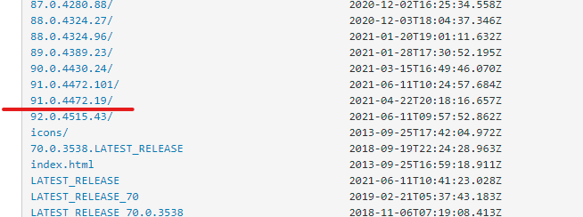
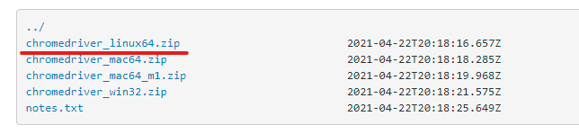

# Linux下安装chrome与chrome driver

## 关于环境

我的环境：

```shell
$ cat /etc/redhat-release 
CentOS Linux release 8.3.2011
```

## 安装 chrome

找个或建立一个喜爱的文件夹：

```shell
$ cd
$ mkdir download
$ cd download
```

先检查下有没有文件下载工具：

```shell
$ rpm -qa|grep wget
```

如果没有已安装信息，通过yum下载并安装文件下载工具：

```shell
$ yum install -y wget
```

下载chrome浏览器（此刻所在位置为：`/root/download`）：

```shell
$ wget -p ./ https://dl.google.com/linux/direct/google-chrome-stable_current_x86_64.rpm
```

通过yum进行安装，因为每个文件夹里只有一个文件夹或文件，一路按tab即可补全到目标文件：

```shell
$ yum localinstall -y ./dl.google.com/linux/direct/google-chrome-stable_current_x86_64.rpm
```

yum会自动下载安装所需依赖，我这里有93个依赖。

如果没有异常则安装完毕！

## 安装浏览器驱动

先检查所安装的chrome版本：

```shell
$ google-chrome --version
Google Chrome 91.0.4472.164 
```

下载chrome驱动，

Chrome驱动网址：https://sites.google.com/a/chromium.org/chromedriver/

国内可能无法访问官方站点，或者可以使用国内的镜像网站下载。

比如淘宝镜像：http://npm.taobao.org/mirrors/chromedriver/

最好找到对应的，如果实在找不到完全对应的，可以找一个接近的，稍微新一些的。我测试了一下，也是可以用的。大版本必须一致！



下载Linux版本：



复制链接地址，在服务器端进行下载（也可以下载后上传至服务器）：

```shell
wget -p ./ http://npm.taobao.org/mirrors/chromedriver/91.0.4472.19/chromedriver_linux64.zip
```

检查有没有zip解压软件：

```shell
$ rpm -aq|grep zip
gzip-1.9-9.el8.x86_64
bzip2-libs-1.0.6-26.el8.x86_64
```

如果没有看到zip和unzip，先yum进行安装：

```shell
$ yum install -y zip
```

解压到当前文件夹：

```shell
$ unzip npm.taobao.org/mirrors/chromedriver/91.0.4472.19/chromedriver_linux64.zip -d ./
Archive:  npm.taobao.org/mirrors/chromedriver/91.0.4472.19/chromedriver_linux64.zip
  inflating: ./chromedriver
```

赋予运行权限：

```shell
$ chmod 777 chromedriver
# 测试一下可不可以运行
$ ./chromedriver --version
ChromeDriver 91.0.4472.19 (1bf021f248676a0b2ab3ee0561d83a59e424c23e-refs/branch-heads/4472@{#288})
```

如果想要在任意地方运行chrome driver，可以有两种选择，如果不需（比如手动指定驱动位置）要可以跳过：

1. 建立软连接
   
   ```shell
   # 软连接一定要使用绝对路径
   $ ln -s /root/download/chromedriver /usr/bin/chromedriver
   ```

2. 复制一份到bin目录
   
   ```shell
   cp chromedriver /usr/bin/
   ```

个人选择第二种方式，更方便，未来不容易产生无用的软连接。

*注：如果系统上有安装多个chrome，建议不要使用这两种方式，可以将chrome driver集成到项目中或放置于特定目录。*

## 安装并运行selenium

我们在没有桌面的centos下安装chrome与chrome driver，通常目的是为了使用selenium。如果你的目的不是这个，可以跳过这部分。

让我们来测试selenium是否可以正确调用chrome。

先安装python3，这里选择python3.8版本，因为3.8版本是最后一个支持win7运行的版本。我们的银行客户只提供无网开发环境与win7电脑，所以为了兼容性选择3.8版本。（现在是2021年7月）

```shell
$ yum install python38
```

注意：直接安装`yum install python3`，安装的并不是最新版本（我这里默认安装3.6版本）。

安装并配置虚拟环境，如果你不希望使用虚拟环境也可以，但还是强烈建议使用虚拟环境：

```shell
$ cd # 进入用户目录（也可选择其目录）
$ mkdir testChromeDriver # 创建测试用例文件夹
$ cd testChromeDriver/ # 进入试用例文件夹
$ pip3 install pipenv # 安装pipenv（若想使用其它虚拟环境也可以，例如原生的venv）
... # 安装过程省略...
$ pipenv install
Creating a virtualenv for this project...
Pipfile: /root/testChromeDriver/Pipfile
Using /usr/bin/python3.8 (3.8.6) to create virtualenv...
⠦ Creating virtual environment...created virtual environment CPython3.8.6.final.0-64 in 1069ms
... # 省略部分日志...
✔ Successfully created virtual environment! 
... # 省略部分日志...
Installing dependencies from Pipfile.lock (db4242)...
  🐍   ▉▉▉▉▉▉▉▉▉▉▉▉▉▉▉▉▉▉▉▉▉▉▉▉▉▉▉▉▉▉▉▉ 0/0 — 00:00:00
To activate this project's virtualenv, run pipenv shell.
Alternatively, run a command inside the virtualenv with pipenv run.
$ ls # 检查有没有产生Pipfile、Pipfile.lock
Pipfile  Pipfile.lock
$ pipenv install selenium
... # 安装过程省略...
$ pipenv graph # 查看虚拟环境已安装的库，看到selenium就是安装成功了
selenium==3.141.0
  - urllib3 [required: Any, installed: 1.26.6]
$ pipenv shell # 进入虚拟环境，此时在命令行最前端应该可以看到"(testChromeDriver)"
```

新建测试文件：

```shell
$ touch test_chrome.py
```

编写测试代码：

```python
# test_driver.py
from selenium.webdriver import Chrome
from selenium.webdriver.chrome.options import Options

chrome_options = Options()
chrome_options.add_argument("--headless")  # 以无头模式
chrome_options.add_argument('--no-sandbox') # 给予root权限，这个在linux环境下必须有

browser = Chrome(options=chrome_options)

browser.get(url='http://www.wanfangdata.com.cn/index.html')
browser.implicitly_wait(5)

a = browser.find_element_by_xpath('/html/body/div[6]/div/div[1]/span[2]')
print(f"标签里的值:{a.text},如果显示为Services，则浏览器与驱动安装正常。")
```

*注：我这里随便找了个网站爬取页面字符串进行测试。此网站随时可能失效。建议自行编写测试代码。*

运行测试代码：

```shell
$ python3 test_chrome.py 
标签里的值:Services,如果显示为Services，则浏览器与驱动安装正常。
```

测试成功！

退出虚拟环境的方式：

```shell
(testChromeDriver) [root@xxxxxxxxxxxx testChromeDriver]# exit
exit
[root@xxxxxxxxxxxx testChromeDriver]# 
```

可以看到`(testChromeDriver)`消失则表示退出成功了。

完毕！
