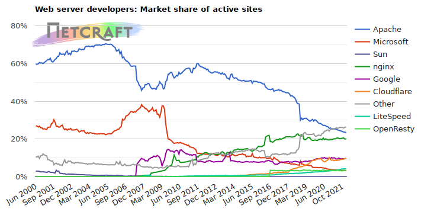
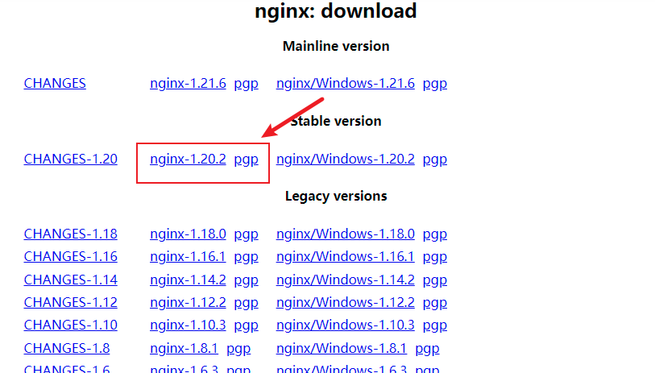

# Nginx

## Nginx？yes！

### 关于集群

集群的优点：

1. 提升性能、并发量。集群可以将流量分发到各个节点，以提高整个系统的性能。
2. 提高系统可用性，避免像单体项目一旦宕机就无法提供服务。
3. 可伸缩。根据流量调整增加或减少节点。

::: warning

在搭建集群时，我么需要关注：

1. 会话需要考虑分布式会话，比如统一放在redis中，或者配置固定用户转发固定ip。
2. 我们应避免多个节点同时跑一模一样的定时任务。定时任务要不要单独做成一个服务？或者使用Quartz这类调度框架？
3. 内网要确认是否互通。

:::

### 关于反向代理

先说说正向代理，我们用过或听过的vpn就是正向代理服务器。我们访问某个网站，可这个网站基于某些原因不为我们提供服务，这时就可以使用vpn，我们将请求发送给vpn提供商，vpn提供商就是我们的代理，帮我们来传达请求，以得到正常的服务。**在正向代理过程中，网站只能接触到vpn提供商，并不知道我们的真实身份。**

而返现代理，是指用户访问网站的代理服务器，由代理服务器来决定转发到哪个服务节点。**在反向代理过程中，我们只知道代理服务器的地址，并不知道服务器的真实节点。**

### why nginx

Nginx (engine x) 是一个高性能的HTTP和反向代理web服务器，同时也提供了IMAP/POP3/SMTP服务。Nginx是由伊戈尔·赛索耶夫为俄罗斯访问量第二的Rambler.ru站点（俄文：Рамблер）开发的，第一个公开版本0.1.0发布于2004年10月4日。

主要功能：

1. 反向代理、通过配置文件实现集群和负载均衡
2. 静态资源虚拟化

nginx及其它服务器受欢迎程度的趋势：



图片来源：[https://news.netcraft.com/](https://news.netcraft.com/)

## 部署nginx

### 下载源码

浏览器在[nginx.org](nginx.org) ，下载下面这个版本：



### 安装依赖

```shell
# 安装依赖环境
# 安装gcc。安装nginx需要先将源码进行编译，编译需要依赖gcc环境。
yum install gcc-c++
# 安装PCRE库，用于解析正则表达式。Nginx的Rewrite模块和HTTP核心模块会使用到PCRE正则表达式语法。这里需要安装两个安装包pcre和pcre-devel。第一个安装包提供编译版本的库，而第二个提供开发阶段的头文件和编译项目的源代码。
yum install -y pcre pcre-devel
# 安装zlib库，压缩与解压缩。zlib库提供了开发人员的压缩算法，在Nginx的各种模块中需要使用gzip压缩。
yum install -y zlib zlib-devel
# 安装Open SSL库， nginx不仅支持 http协议，还支持 https（即在 ssl 协议上传输 http），如果使用了 https，需要安装 OpenSSL 库。
yum install -y openssl openssl-devel
```

### 解压源码

```shell
tar -zxvf nginx-1.20.2.tar.gz
```

### 编译

编译之前要创建nginx临时目录，如果不创建、在启动nginx过程中会报错。

```shell
mkdir /var/temp/nginx -p
```

在nginx目录执行配置：

```shell
./configure \
--prefix=/usr/local/nginx \
--pid-path=/var/run/nginx/nginx.pid \
--lock-path=/var/lock/nginx.lock \
--error-log-path=/var/log/nginx/error.log \
--http-log-path=/var/log/nginx/access.log \
--with-http_gzip_static_module \
--with-http_ssl_module \
--http-client-body-temp-path=/var/temp/nginx/client \
--http-proxy-temp-path=/var/temp/nginx/proxy \
--http-fastcgi-temp-path=/var/temp/nginx/fastcgi \
--http-uwsgi-temp-path=/var/temp/nginx/uwsgi \
--http-scgi-temp-path=/var/temp/nginx/scgi
```

> configure命令参数具体说明：
> 
> - --prefix=path — 定义服务器文件的完整路径，该路径同时也是configure命令设置的 相对路径（除类库源文件外）以及nginx.conf文件定义的相对路径的基准路径。其默认 值是/usr/local/nginx。
> - --sbin-path=path — 设置nginx可执行文件的完整路径，该路径仅在安装期间使用， 默认路径为prefix/sbin/nginx。
> - --conf-path=path — 设置配置文件nginx.conf的完整路径。如有必要，总是可以 在nginx启动时通过命令行参数-cfile指定一个不同的配置文件路径。 默认路径为prefix/conf/nginx.conf。
> - --pid-path=path — 设置nginx.pid文件的完整路径，该文件存储了主进程的进程ID。安装完成后， 该路径总是可以在nginx.conf文件中用 pid指令来修改。 默认路径为prefix/logs/nginx.pid。
> - --error-log-path=path — 设置记录主要错误、警告以及调试信息日志的完整路径。安装完成后， 该路径总是可以在nginx.conf文件中用 error_log 指令来修改。 默认路径为prefix/logs/error.log。
> - --http-log-path=path — 设置记录HTTP服务器主要请求日志的完整路径。安装完成后， 该路径总是可以在nginx.conf文件用 access_log 指令来修改。 默认路径为prefix/logs/access.log
> - --user=name — 设置工作进程以某非特权用户的身份运行。安装完成后，该用户名总是可以在 nginx.conf文件用user指令来修改。 其默认值为nobody。
> - --group=name — 设置工作进程以某非特权用户的身份运行。安装完成后，该用户名总是可以在 nginx.conf用user指令来修改。 其默认名称与未授权用户名称相同。
> - --with-select_module
> - --without-select_module — 设置是否将select()方法模块编译进nginx中。如果系统平台不支持kqueue、epoll、rtsig或/dev/poll等更合适的方法， 该模块会被自动编译。
> - --with-poll_module
> - --without-poll_module — 设置是否将poll()方法模块编译进nginx中。如果系统平台不支持kqueue、epoll、rtsig或/dev/poll等更合适的方法， 该模块会被自动编译。
> - --without-http_gzip_module — 不编译http_gzip_module模块。该模块可以压缩HTTP服务器的响应，该模块需要zlib库才能编译和运行。
> - --without-http_rewrite_module — 不编译http_rewrite_module模块。该模块允许HTTP服务器重定向请求，改变请求的URI地址 。创建并运行该模块需要PCRE库支持。
> - --without-http_proxy_module — 不编译HTTP服务器的代理模块。
> - --with-http_ssl_module — 为HTTP服务器编译HTTPS协议支持的模块。该模块默认是不编译的。它需要OpenSSL库才能编译和运行。
> - --with-pcre=path — 设置PCRE库源文件的路径地址。PCRE库的发行版(version 4.4 — 8.30)需要先从PCRE站点下载并解压缩。 剩下的安装工作由nginx的./configure和make命令来完成。该库应用于location 指令的正则表达式支持以及ngx_http_rewrite_module模块。
> - --with-pcre-jit — 编译PCRE库时增加“实时编译（pcre_jit）”支持。
> - --with-zlib=path — 设置zlib库源文件的路径地址。zlib库的发行版(version 1.1.3 — 1.2.5)需要先从zlib站点下载并解压缩。 剩下的安装工作由nginx的./configure和make命令来完成。该库应用于 ngx_http_gzip_module模块。
> - --with-cc-opt=parameters — 设置将会添加额外参数到CFLAGS变量中。当在FreeBSD使用系统PCRE库时，需要指定 `--with-cc-opt="-I /usr/local/include"` 。 如果需要增加select()方法所支持的文件数量，也可以参照如下方式指定：`--with-cc-opt="-D FD_SETSIZE=2048"` 。
> - --with-ld-opt=parameters — 设置将会在链接（linking）过程中使用的额外参数。当在FreeBSD使用系统PCRE库时，需要指定 --with-ld-opt="-L /usr/local/lib"。

如果成功产生makefile配置文件，执行 `make` 命令即可编译。

`make` 结束后 ，执行`make install` 命令即可安装nginx。

## 基本操作

常用命令：

- `./nginx` 开启
- `./nginx -s stop` 停止
- `./nginx -t` 测试文件正确性
- `./nginx -s reload` 重新加载

## Nginx的进程模型

Nginx默认有两个进程：

1. master进程（主进程）
2. worker进程（工作进程）

master进程只有一个，而worker进程数量可通过nginx.conf进行配置：

```nginx
# 位置：全局块
worker_processes 1;
```

master进程是用来管理worker进程的，worker进程用来进行工作。master接受外来信号后将任务分发给worker。类似于老板接了业务后把工作分发给下面的员工。如果worker因为某些原因停工了，master会把任务再分配给其它worker。

我们的nginx命令就是发送给master的。我们只与master打交道，不必关心worker。

举个例子，当我们执行 `./nginx -s stop` masker会将信号转发给worker，并不再接受及派发更多任务给worker。如果worker处于空闲状态，会直接退出。如果处于工作状态，会将当前工作执行完后再退出。

再举个例子，如果有一个worker挂掉了，master会将任务暂时交给其它worker，并重新fork一个新的worker。

## 或许你会遇到

### 403 request entity too large

因为nginx限制了body传输大小，修改nginx配置即可。

```nginx
http {
    ...
    client_max_body_size   50m;
    ...
}
```
