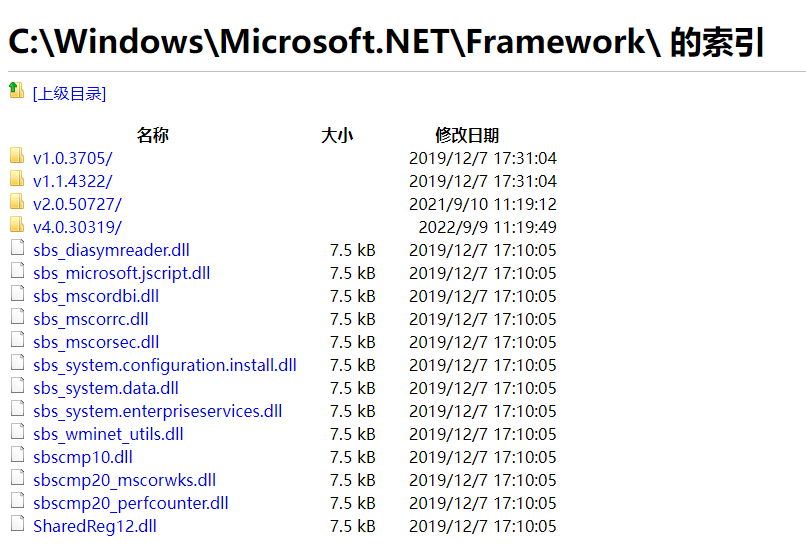
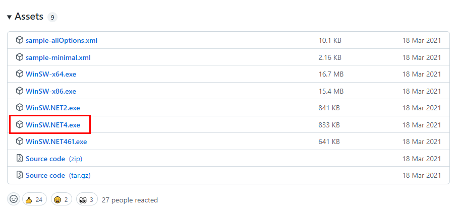

winsw是一个在windows下可执行的二进制文件。我们可以把它理解成工具，或者一个容器，它可以将你的程序打包为一个**windows服务**。

相比其它打包工具，它最主要优势有：

1. 商业许可（MIT协议）

2. 不限制打包内容，不像很多工具只可以打包固定语言所编写的软件。

如果需要使程序以windows服务的形式运行，那么winsw会是最好的选择。

目前主要的版本是正在积极开发（alpha）的3版本，及比较普及的2版本。基于实际考虑，2版本对绝大多数情况会是更好的选择。

## 下载

下载地址点击这里：[点我点我](https://github.com/winsw/winsw/releases)。

winsw为 .NET Framework 2.0、4.0 和 4.6.1提供了对应的二进制文件。

判断.net版本，可以通过地址栏输入 `C:\Windows\Microsoft.NET\Framework` 并按回车进行检查。



可以看到我电脑最新的 `.NET Framework` 版本为4.0，我电脑上最适合的版本为：



其实在不确定目标机器环境的情况下，尤其是客户万年不换的老旧操作系统，不依赖 `.NET Framework` 的 `WinSW-x64.exe` 和 `WinSW-x86.exe` 可能是更好的选择。

## 操作步骤

为了设置 WinSW，您通常需要执行以下步骤：

1. 编写*myapp.xml* （有关详细信息，请参阅[XML 配置文件规范）](https://github.com/winsw/winsw/blob/master/doc/xmlConfigFile.md)
2. 将这两个文件**并排放置**，因为这就是 WinSW 发现其配置的方式。
3. 运行`myapp.exe install <OPTIONS>`以安装服务包装器。
4. 运行`myapp.exe start`以启动服务。

可以使用这些进程的退出代码来确定操作是否成功，不是0就是失败。点这里看详情：[这里](https://docs.microsoft.com/zh-cn/windows/win32/cimwin32prov/create-method-in-class-win32-service#return-value)。

## xml配置

其实除了写xml没有什么需要太多思考的地方。写yml其实也是可以的，酌情进行选择即可。

就我的经历，如果是为了给客户的windows服务器使用，通常使用windows作为服务器的客户很可能是守旧的。这时大概率会面临糟糕的服务器编辑体验，比如一个古老的记事本软件。这时xml对缩进不敏感的特点反而会救人一命。

官网示例：

```xml
<service>
  <id>jenkins</id>
  <name>Jenkins</name>
  <description>This service runs Jenkins continuous integration system.</description>
  <env name="JENKINS_HOME" value="%BASE%"/>
  <executable>java</executable>
  <arguments>-Xrs -Xmx256m -jar "%BASE%\jenkins.war" --httpPort=8080</arguments>
  <log mode="roll"></log>
</service>
```

常用配置：

`id`：指定 Windows 内部用于标识服务的 ID。这在系统中安装的所有服务中必须是唯一的，并且应该完全由字母数字字符组成。

`name`：服务的短显示名称，可以包含空格和其他字符。这不应该太长，就像 `<id>` 一样，并且这也需要在给定系统中的所有服务中是唯一的。

`description`：用来给人看的长描述。选择服务后，这将显示在 Windows 服务管理器中。

`executable`：执行的命令，比如启动springboot应用的命令java。

`arguments`：命令执行参数，比如 包路径，类路径等。

详情文档在[这里](https://github.com/winsw/winsw/blob/master/doc/xmlConfigFile.md)。

## 其它命令

- `install`将服务安装到 Windows 服务控制器。此命令需要[安装指南](https://github.com/winsw/winsw/blob/master/doc/installation.md)中描述的一些初步步骤。
- `uninstall`卸载服务。与上述相反的操作。
- `start`启动服务。该服务必须已经安装。
- `stop`停止服务。
- `stopwait`停止服务并等到它实际停止。
- `restart`重新启动服务。如果服务当前未运行，则此命令的作用类似于`start`.
- `status`检查服务的当前状态。
  - 此命令将一行打印到控制台。
    - `NonExistent`表示当前未安装该服务
    - `Started`表示服务当前正在运行
    - `Stopped`表示该服务已安装但当前未运行。
