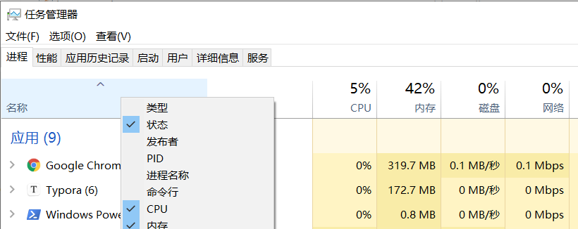

# java web


## web应用

所谓 web应用，就是在服务器部署，在浏览器上使用的应用。web应用的架构被称为B/S架构（Browser/Server Architecture）。


### 浏览器可以做什么？

通过浏览器客户可以访问与使用两类资源，一类叫做静态资源，另一类叫做动态资源。

所谓静态资源，就是无论是谁访问，得到结果都相同的资源。比如一个网页，一个图片，一段javascrap脚本。就像这篇博客一样。

而动态资源就有趣了，每个人访问后所得到的可能会有所不同。比如每个人的朋友圈，或者朋友圈广告:dog:（想象一下，为了确保你可能需要，至少不讨厌，这条广告推送到你的朋友圈前经历了多少数据的分析）。


浏览器可以解析静态资源，将干巴巴的html代码转化为丰富多彩页面。那么动态资源呢？动态资源需要先被转换为静态资源，然后再交给浏览器解析供用户使用。


### 服务器又是什么?

安装了服务器软件的计算机就是服务器。其实通常就是一台配置比你的高、价格比你的贵的电脑。

如果我们在上面安装一个数据库，就可以说它是一台数据库服务器；

如果我们在上面安装个服务器软件（nginx、tom cat之类的），那它就是一台web服务器。

如果我们在上面安装一个3A大作(A lot of time，A lot of resources，A lot of money)，就可以吹牛拥有了一台高配游戏主机...


那么什么又是服务器软件？

服务器软件可以接受用户的请求、处理用户的请求、再给用户一些回应（响应）。

而web服务器，我们可以在上面部署项目，让用户通过浏览器访问这些项目。

因为在过去通常我们的项目都会放在服务器的文件夹中，所以也有人把web服务器叫做web容器。


#### 常见的服务器软件

常见的java web服务器软件：

1. webLogic：oracle公司所提供的大型javaEE服务器，支持所有的javaEE规范，**它是收费的**！*javaEE：java语言在企业级开发中使用的技术规范总和，一共规定了13项大的规范。*
2. webSphere：IBM公司所提供的大型javaEE服务器，支持所有的javaEE规范，**它也是收费的**！
3. JBoss：JBoss公司所提供的大型javaEE服务器，支持所有的javaEE规范。它可以免费使用，**但文档与其它服务都是收费的，要用还是要花钱的...**
4. Tomcat：Apache基金组织提供的中小型javaEE服务器，仅仅支持少量javaEE规范（servlet/jsp）。它是开源免费的。


### 网络通信三要素

1. IP：电子设备（计算机，其实这里就是服务器啦）在网络中的唯一标识。
2. 端口号：应用程序在计算机中的唯一标识，可以区分不同正在运行的app。数字范围在0~65536之间。
3. 传输协议：规定数据通信的规则。包括：
   1. tcp：安全的协议，因为要三次握手。
   2. udp：它不安全，可能会丢数据，但是效率很高，因为不用动不动就去握手。


## Tom Cat

Apache基金组织提供的中小型javaEE服务器，仅仅支持少量javaEE规范（servlet/jsp）。它是开源免费的。

它是免费javaEE服务器中最好用的。

官网：[https://tomcat.apache.org/](https://tomcat.apache.org/)

### 目录结构

tomcat的目录结构大致如下：

```
└─ apache-tomcat-9.0.52
   ├─ bin
   ├─ conf
   ├─ lib
   ├─ logs
   ├─ temp
   ├─ webapps
   └─ work
```
各个文件夹的作用如下：

| 文件夹   | 作用                                                         |
| -------- | ------------------------------------------------------------ |
| /bin     | 用来存放可执行文件（用来启动、关闭tomcat等）。比如 `*.sh`文件（适用于Unix系统），`*.bat`文件（适用于Windows系统）。 |
| /conf    | 存放配置文件。这里最重要的文件是 server.xml，它是容器的主要配置文件。 |
| /lib     | 存放依赖的jar包。所以tomcat本身也是用java写的。              |
| /logs    | 默认情况下，日志文件在此处。                                 |
| /temp    | 存放临时文件。                                               |
| /webapps | 这是您的 web 应用程序所在的位置。                            |
| /work    | 存放运行时的数据（jsp会用）。                                |

### 常用操作

以windows操作系统为例：

- 启动：找到 `/bin/startup.bat` ，双击运行即可。
- 访问：浏览器地址栏输入 [http://localhost:8080](http://localhost:8080) 回车访问自己本机的tomcat应用。
- 关闭：找到 `/bin/shutduwn.bat` ，双击就可以关掉啦。当然，直接关掉黑窗窗也可以，拔电源也可以。

### 部署方式

1. 可以直接将项目放在webapps目录下。或者将项目压缩为war文件，丢到webapp下，tomcat会自动解压缩。
2. 一个不太常用的方式：可以修改server.xml，在` <Host> `中添加 `<Context docBase="项目存放路径" path="虚拟目录" />`。不推荐这种方式，server.xml 轻易不应该修改。如果要在wabapps目录外部署，可以参考下一种方式。
2. 在 `/conf/Catalina/localhost` 创建任意名称的xml文件。在文件中编写：`<Context docBase="项目存放路径" />` ,xml文件的名称就是虚拟路径。


::: tip
如果双击`/bin/startup.bat`发现黑窗口一闪而过，检查是否配置`JAVA_HOME`环境变量
:::


::: details 如果端口号被占用如何解决

控制台输入：`netstat -ano` ,找到对应的端口号，记住对应的PID（进程id）

在任务管理器中找到对应的进程关闭即可（如果你知道你将要关掉的是什么）。

如果任务管理器不显示PID？

右键这个位置，可以勾选PID选项：



如果不方便关闭占用端口的应用程序，或者也可以让步，修改tomcat的端口号，找到 `server.xml` ，修改以下行中的 `port` 和 `redirectPort` ：

```xml
<Connector port="8080" protocol="HTTP/1.1" connectionTimeout="20000" redirectPort="8443" />
```

*要修改的可能不止一个端口号，那个被占用改哪个*

:::


### server.xml

可以在这里改端口号：

```xml
<Connector port="8080" protocol="HTTP/1.1" connectionTimeout="20000" redirectPort="8443" />
```

一般会在生产时将端口号改为“80”，这是浏览器的默认访问端口号。

可以改主机的名称、网站存放地点：

```xml
<Host appBase="webapps" autoDeploy="true" name="localhost" unpackWARs="true">
```

所以将项目放在webapps下就可以进行访问了。

如果更改了`name="localhost"`，比如`name="shoucy"`，就无法访问了，原因是因为我们的本机缺少相应的Host配置（云端DNS更不可能有），手动添加可以解决。

> 网站是如何进行访问的？
>
> 1. 输入一个域名，按下回车。
> 2. 操作系统在Host配置目录中寻找IP。以windows为例，配置文件的地址为：`C:windows\System32\drivers\etc`。如果有就可以直接返回对应的ip地址了。
> 3. 如果系统Host配置中没有该域名，则访问DNS服务器（当然，中间还有好几个交换机），DNS会返回真实的IP。


### webapps目录结构

如果部署的是一个java web项目，webapps下的文件应该是这样一个目录：

```
└─ 项目根目录
   ├─ WEB-INF
   │   ├─ web.xml：web项目核心配置文件
   │   ├─ classes文件夹：放置字节码文件
   │   └─ lib文件夹: web应用所依赖jar
   ├─ index.html:默认首页
   └─ static
       ├─ css
       ├─ js
       └─ img
```

*如果要部署的是一个静态资源项目，那么比tomcat更好的选择有很多，比如Nginx、Apache Server。*


## HTTP

超文本传输协议（Hyper Text Transfer Protocol，HTTP）是一个简单的请求-响应协议，它通常运行在TCP之上。

### 两个时代

HTTP/1.0：客户端与web服务器链接后，只能获取一个web资源。

HTTP/1.1：客户端与web服务器链接后，只能获取多个web资源。

###  Http的请求与响应

#### 请求

客户端发请求至web服务器

General：

```
Request URL: https://www.baidu.com/
Request Method: GET
Status Code: 200 OK
Remote Address: 110.242.68.4:443
Referrer Policy: strict-origin-when-cross-origin
```

Remote Address：远程地址，此次请求真实访问的ip地址与端口

**请求行**

```
Request Method: GET
```

- GET：携带参数少，长度有限制，会在URL显示数据内容，不安全，但是高效。
- POST：和GET相反。不高效，但是随着网络发展的进步，这个缺点已经不需要被刻意关注。

#### 响应

Response Headers：

```
Cache-Control: private
Connection: keep-alive
Content-Encoding: gzip
Content-Type: text/html;charset=utf-8
Date: Sun, 22 Aug 2021 02:47:15 GMT
Expires: Sun, 22 Aug 2021 02:47:15 GMT
Server: BWS/1.1
Set-Cookie: BDSVRTM=266; path=/
Set-Cookie: BD_HOME=1; path=/
Set-Cookie: H_PS_PSSID=34401_31660_33848_34092_34106_26350_34428_22160_34387; path=/; domain=.baidu.com
Strict-Transport-Security: max-age=172800
Traceid: 1629600435235426023418195240388107828868
Transfer-Encoding: chunked
X-Frame-Options: sameorigin
X-Ua-Compatible: IE=Edge,chrome=1
```

Cache-Control：缓存控制

`Connection: keep-alive` 说明此次请求走的是Http/1.1

**响应状态码**

200：请求响应成功

3**：重定向

4**：找不到资源

5**：服务器端代码错误


## Servlet

Servlte是sun公司开发的一门动态web技术。它是两个单词的缩写 server applet。

既然我们需要把java web项目丢在了服务器上，由服务器来执行，必然是没有main方法可以运行的。那么我们的任意java代码都可以被服务器调取吗？当然不是的，只有遵守一定的规则（接口），tomcat才可以识别，接着创建实例调取方法等。而这个规则通常就是servlet。

Servlet也是一个接口，我们的类只要实现Servlet，就可以被tomcat识别。我们把实现Servlet接口的java程序，也叫做Servlet。

Servlet在sun公司有两个实现类：

1. HttpServlet

2. GenericServlet

其中HttpServlet是GenericServlet的抽象实现类

### dependencies

maven dependencies：

```xml
<dependency>
    <groupId>javax.servlet</groupId>
    <artifactId>javax.servlet-api</artifactId>
    <version>4.0.1</version>
</dependency>
<dependency>
    <groupId>javax.servlet.jsp</groupId>
    <artifactId>javax.servlet.jsp-api</artifactId>
    <version>2.3.3</version>
</dependency>
```

### demo

一个简单的demo

#### 编写servlet代码

```java
package com.scy.servlet;

import javax.servlet.ServletException;
import javax.servlet.http.HttpServlet;
import javax.servlet.http.HttpServletRequest;
import javax.servlet.http.HttpServletResponse;
import java.io.IOException;
import java.io.PrintWriter;

public class HelloServlet extends HttpServlet {

    // GET和POST只是请求方式的不同实现，如果业务逻辑一样，可以相互调用
    @Override
    protected void doGet(HttpServletRequest req, HttpServletResponse resp) throws ServletException, IOException {
        PrintWriter writer = resp.getWriter();//响应流
        writer.print("hello,servlet");
    }

    @Override
    protected void doPost(HttpServletRequest req, HttpServletResponse resp) throws ServletException, IOException {
        doGet(req,resp);
    }
}
```

#### 编写servlet映射

为什么需要映射呢？

我们编写的是java类，而浏览器在访问时需要连接web服务器。因此我们需要在web服务中进行注册我们写的servlet，并提供浏览器访问路径。

web.xml：

```xml
<!-- 注册servlet -->
<servlet>
    <servlet-name>hello</servlet-name>
    <servlet-class>com.scy.servlet.HelloServlet</servlet-class>
</servlet>
<!-- servlet的请求路径 -->
<servlet-mapping>
    <servlet-name>hello</servlet-name>
    <url-pattern>/hello</url-pattern>
</servlet-mapping>
```

#### 配置tomcat

tomcat配置项目路径即可

#### 启动测试

浏览器访问项目路径加请求路径（/hello）即可

### 原理

1. 当服务器接收到客户端浏览器的请求后，会解析请求URL路径，获取访问的Servlet资源路径。
2. 查找web.xml文件，是否有对应的 `<url-pattern>` 标签体内容。
3. 如果有，找到对应的  `<servlet-class>` 全类名。
4. tomcat会将字节码文件加载至内存，并创建对象。
5. 调用其方法。

### servlet的生命周期

servlet有几个生命周期方法：

#### init()

被创建时调用，只执行一次。默认情况下，在第一次被访问时servlet会被创建。

*可以通过修改web.xml中的 `<load-on-startup>` 标签进行修改，为负整数则第一次访问创建，正整数时服务器启动时创建。*

这也说明了，**servlet是单例的**。不要在servlet中定义成员变量！

#### service()

每次被访问时调用一次。

#### distory()

servlet**被销毁前执行**。只有服务器正常关闭才会触发。一般用于释放资源。

### Servlet3.0注解配置

servlet3.0后支持了注解配置，可以不创建啰嗦的web.xml了。

在class上添加注解以完成地址映射：

```java
@WebServlet(urlPatterns="/demo")
```

也可以省略属性名，会自动作为 `value` 属性：

```java
@WebServlet("/demo")
```


## Mapping

如果闲的蛋疼，可以自定义后缀实现请求映射。

```xml
<servlet-mapping>
    <servlet-name>hello</servlet-name>
    <url-pattern>/*.do</url-pattern>
</servlet-mapping>
```

ps：`*` 前不可以加任何路径


如果还蛋疼，可以指定默认请求路径，比如：

```xml
<servlet-mapping>
    <servlet-name>hello</servlet-name>
    <url-pattern>/*</url-pattern>
</servlet-mapping>
```

这样做可以代替404什么的，当然，这做法很蠢。

指定了固有的路径优先级最高，找不到的话，就会走默认的路径请求。

## Servlet Context

web容器启动的时候，它会为每个web程序都创建一个对应的ServletContext对象，它代表了当前的web应用。

大概有以下几个作用（但是这几个功能在企业开发都会被替代掉）：

### 共享数据

在一个servlet中保存的数据，可以在另一个Servlet中拿到。实现全局共享；

存数据：

```java
public class HelloServlet extends HttpServlet {

    @Override
    protected void doGet(HttpServletRequest req, HttpServletResponse resp) throws ServletException, IOException {
        ServletContext context = this.getServletContext();
        context.setAttribute("name", "naruto");
    }

    @Override
    protected void doPost(HttpServletRequest req, HttpServletResponse resp) throws ServletException, IOException {
        doGet(req, resp);
    }
}
```

取数据：

```java
public class ByeServlet extends HelloServlet {
    @Override
    protected void doGet(HttpServletRequest req, HttpServletResponse resp) throws ServletException, IOException {
        ServletContext context = this.getServletContext();
        Object name = context.getAttribute("name");
        resp.setContentType("text/html");
        resp.setCharacterEncoding("utf-8");
        resp.getWriter().print("name:" + name);
    }

    @Override
    protected void doPost(HttpServletRequest req, HttpServletResponse resp) throws ServletException, IOException {
        doGet(req, resp);
    }
}
```

配置web.xml：

```xml
<!-- 注册servlet -->
<servlet>
    <servlet-name>hello</servlet-name>
    <servlet-class>com.scy.servlet.HelloServlet</servlet-class>
</servlet>
<!-- servlet的请求路径 -->
<servlet-mapping>
    <servlet-name>hello</servlet-name>
    <url-pattern>/hello</url-pattern>
</servlet-mapping>

<!-- 注册servlet -->
<servlet>
    <servlet-name>bye</servlet-name>
    <servlet-class>com.scy.servlet.ByeServlet</servlet-class>
</servlet>
<!-- servlet的请求路径 -->
<servlet-mapping>
    <servlet-name>bye</servlet-name>
    <url-pattern>/bye</url-pattern>
</servlet-mapping>
```

### 初始化参数

这个用处不大，可以在web启动时写入一些全局参数。

方法如下，写入参数：

```xml
<!-- web.xml -->
<context-param>
    <param-name>url</param-name>
    <param-value>jdbc:mysql://localhost:3306/mybatis</param-value>
</context-param>
```

读取：

```java
protected void doGet(HttpServletRequest req, HttpServletResponse resp) throws ServletException, IOException {
    ServletContext context = this.getServletContext();
    String url = context.getInitParameter("url");
    resp.getWriter().print(url);
}
```

基本上，没啥用。

### 请求转发

转发不会改变路径名

```java
protected void doGet(HttpServletRequest req, HttpServletResponse resp) throws ServletException, IOException {
    ServletContext context = this.getServletContext();
    RequestDispatcher requestDispatcher = context.getRequestDispatcher("/bye");//转发请求路径
    requestDispatcher.forward(req, resp);//调用forward实现转发请求
}
```

### 读取资源文件

这个很常用的

我有一个配置文件，在`resources/db.properties`,因为用了maven，编译后它的位置在`WEB-INF/classes/db.properties`。

读取：

```java
protected void doGet(HttpServletRequest req, HttpServletResponse resp) throws ServletException, IOException {
    ServletContext context = this.getServletContext();
    // 通过web资源路径获取一个流
    InputStream resourceAsStream = context.getResourceAsStream("WEB-INF/classes/db.properties");
    Properties properties = new Properties();
    // 加载到properties类
    properties.load(resourceAsStream);
    String username = properties.getProperty("username");
    resp.getWriter().println(username);
    String password = properties.getProperty("password");
    resp.getWriter().print(password);
}
```


## 请求与响应对象

web服务器接收到http请求，会分别创建代表请求的`HttpServletRequest`和代表响应的`HttpServletResponse`。

如果要获取客户端请求传来的参数，使用`HttpServletRequest`；

如果要响应给客户端，使用`HttpServletResponse`。

### HttpServletResponse

它可以：

1. 像浏览器输出消息（页面显示）
2. 下载文件
   1. 获取下载文件路径与文件名
   2. 让浏览器支持下载我们所提供的文件
   3. 获取下载文件的输入流
   4. 创建缓冲区
   5. 获取OutputStream对象
   6. 将FileOutputStream写入到buffer缓冲区
   7. 使用OutputStream缓冲区的数据输出到客户端

#### 文件下载

```java
protected void doGet(HttpServletRequest req, HttpServletResponse resp) throws IOException {
    // 获取下载文件名
    String realPath = "E:\\IdeaProjects\\XXXXX\\壁纸.png";
    String fileName = realPath.substring(realPath.lastIndexOf("\\") + 1);
    // 使浏览器支持Content-Disposition
    resp.setHeader("Content-Disposition", "attachment;filename=" + URLEncoder.encode(fileName, "utf-8"));
    // 获取文件输入流
    FileInputStream in = new FileInputStream(realPath);
    int len = 0;
    byte[] buffer = new byte[1024];
    // 获取OutputStream对象
    ServletOutputStream out = resp.getOutputStream();
    while ((len = in.read(buffer)) > 0) {
        out.write(buffer, 0, len);
    }
    in.close();
    out.close();
}
```

#### 重定向


