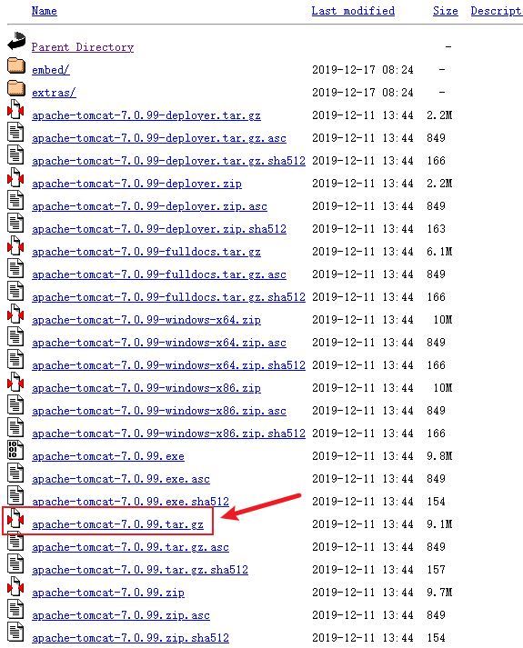

## 安装Tomcat

当前最新版本下载地址：

[https://tomcat.apache.org/](https://tomcat.apache.org/)

历史版本下载地址：

[https://archive.apache.org/dist/tomcat/](https://archive.apache.org/dist/tomcat/)

下载历史版本时，安装包在bin目录下：


下载以tar.gz为后缀的版本：



### 解压

```shell
$ tar -zxvf apache-tomcat-7.0.99.tar.gz -C /usr/local/
```

### 配置开机自启

在 `/etc/rc.d/rc.local` 文件最后加上：

```
export JAVA_HOME=/usr/local/java/jdk1.7.0_80
/usr/local/apache-tomcat-7.0.99/bin/startup.sh start
```

说明：

- `/usr/local/java/jdk1.7.0_80` 是jdk安装目录
- `/usr/local/apache-tomcat-7.0.99` 是tomcat安装的目录

修改rc.local文件为可执行

```shell
chmod +x  rc.local  
```

::: tip

重启服务器命令是 `reboot` 。

:::

完毕，撒花！:tada:

