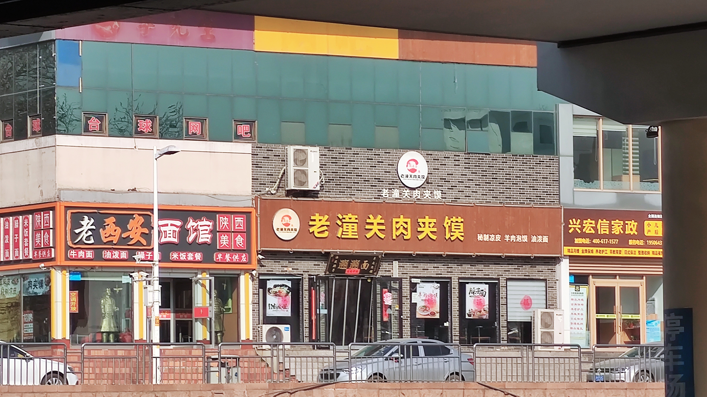

因为工作原因在博兴居住了半年。

## 就这么到了博兴

老板签了一个二次开发项目，客户在博兴，客户要求开发驻场，然后我就被派遣到了博兴。就...挺突然的，是我人生第一次出差。

2月28日

6点起床，迷迷糊糊的刷牙洗脸，拎起提前准备好的行李箱，去高铁站，乘高铁到淄博。

### 淄博

能站到淄博还是挺激动的，因为那时喜欢看朱一旦的视频，他是淄博人，还唱了首歌叫做《淄加哥》，mv中手戴劳力士，每个手指都戴着金戒指，最后一句“资本家的城市，枯燥且朴实无华”。我一直以为这里会是纸醉金迷的地方...或许纸醉金迷只在夜晚吧（强行解释）。

淄博火车站门口广场比较小，车又比较多，只好在侧边拍。

我看到了兵马俑:joy:。

从淄博做大巴到了博兴。去酒店办理入住后，又急急忙忙去核酸，等回到酒店瘫在床上时，已经快10点了。

在博兴放下行李就

大约7点半到达

博兴是个县城，隶属山东省滨州市。这里有很多外地人，都是因为求职或出差所以过来。这里没什么旅游景点，也没太多文化底蕴，能来的都是为了赚钱。

## 印象

从
