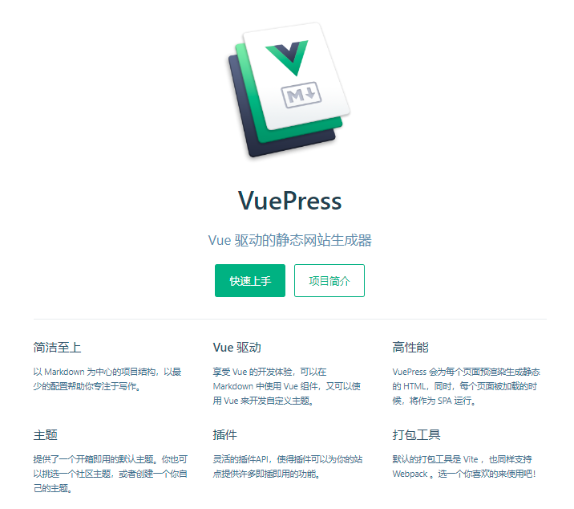
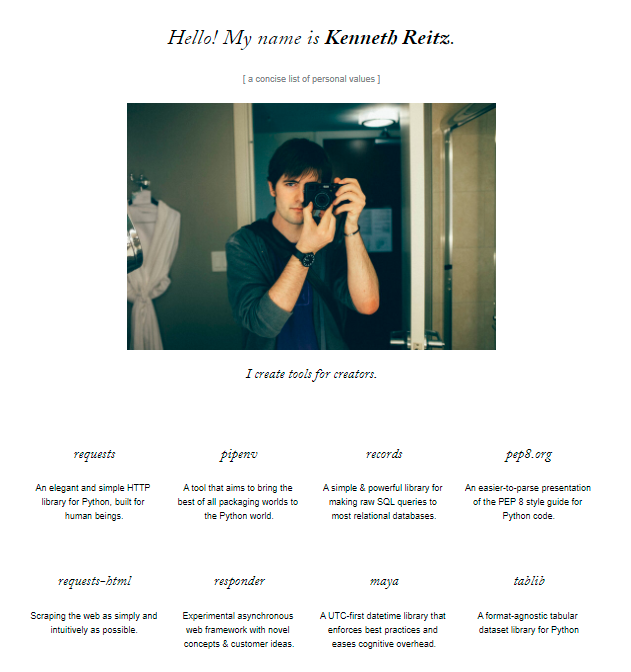

---

layout: Post

title: 关于博客的碎碎念

subtitle: 菜鸡搭建博客时遇到的各种琐事

headerImage: /img/in-post/my-blog.jpg

useHeaderImage: true

date: 2022-07-31

tags: 
  - 碎碎念

---

搭建博客真是一个坎坷又有趣的事情。这篇记录了本菜鸡经历的磨难。当然，最优解永远都是不存在的，我还能一直捯饬下去。

<!-- more -->

之所以写这篇博客，很大一部分原因是因为刚好看到了一位老哥的[这篇博客](https://blog.zxh.io/post/2020/10/07/my-blog/)。感慨大家搭建博客的历程是那么相近。区别是她做出了这个漂亮的博客主题，而本菜鸡的水平只能拿来用用（也许未来会忍不住拿来瞎改hhh）。

## 起因

### 笔记软件的劝退

因为学习编程的过程中记录了一些笔记，需要存储在哪里方便查阅。知乎那时经常推印象笔记的使用技巧，就用了很久的印象笔记。直到被它的祖传bug以及vip、vvip、vvvip、vvvvip所劝退（我还真的充了3年，然而它还是隔三岔五提醒我续费，可能是需要再续500年）。网易云笔记、为知笔记也都试过，没有找到心仪的软件。国外的notion我很喜欢，可因为国内糟糕的访问速度，我只能用它记录不需要频繁查阅的私人笔记。

在见证一个算得上优秀的笔记软件一步步变成一个氪金软件（印象笔记就差增加贷款功能了:upside_down_face:）。决定不相信任何国内的网络存储笔记，完全依赖本地化存储。

可一方面需要随时随地进行查阅（需要的时候私人电脑不在手边），另一方面，自己有一点点分享欲，所以又开始捯饬既可以本地存储，又可以网络同步的方案。

坚果云、OneDrive等同步盘方案也试了，没有满意的方案。在这个时候，我想到去做一个博客。

### 搭建博客貌似没那么难

那时市面又有很多教学视频，教你怎么以项目的方式手写一个博客。有前端、有后台、有数据库。有完整的各个功能：富文本编辑器、标签、时间轴、评论系统等。是我几乎放弃了搭建博客，心想我就想安安静静敲点字就这么麻烦吗，博主一定都是世界上最勤快的人。事实证明：只有懒惰才会丰富人的知识。

我将注意力转移到了各个可以写文章的平台：csdn、博客园、知乎专栏等等。并没有找到合适的方案，不是广告多到我写了博客都不好意思让别人看，就是UI超越了我的审美，或者是不登陆不上看全文等骚操作。很快我就放弃了。

后来因为神奇的原因，我了解到了**静态网站生成器**。

## Github Pages与Jekyll

后来在~~同性交友社区~~Github上发现有个东东叫 Github Pages，把前端页面及静态资源丢在上面就可以直接通过Github的域名访问，简直不要太酷好不好！

于是我在照官方教程操作了一遍，并成功通过带有自己名字的域名访问后。差点打算用纯html写博客，还好我读完了文档。ps：打算使用某个技术，通读文档真的是好习惯。

我得知Github Pages不但可以丢html，还可以丢以`.md`结尾makdown文件。因为Github Pages默认集成了一个叫做Jekyll的静态网站生成器。所以写博客原来是可以不用写代码的。

有挺长一段时间，我都在使用这种方式写博客，享受着Github Pages自带Jekyll带来的便利。因为真的很方便，把markdown文件上传到github上，过一小会儿就可以在网站上看到了。直到我觉得它有点丑。

丑是可以通过使用主题解决的，但我优先考虑了使用其它工具。Github Pages的文档除了Jekyll，还提到了Hexo、Hugo。一个是用js实现的，另一个是基于Golang。考虑到我对Golang的认知为0（js也没多多少），选择了Hexo。

## Hexo

Hexo是我的心头好，即便我现在没有继续使用Hexo，我也会对每个想要写博客的朋友推荐它。

Hexo有丰富的配置项，还带有一个很方便的发布工具（CLI形式），一键构建并发布到GitHub仓库。效率貌似也比Jekyll快。是非常成熟的博客工具。

之所以放弃它，是基于挺无奈的原因。虽然我写的是博客，但其实绝大部分的文章其实算是笔记，我希望可以将这些笔记按照多级文件夹按知识分类进行整理。但Hexo真的纯粹是写博客的，它很强调时间性，会将文章按时间整理，并放在同一个文件夹中。这点让我十分的苦恼。

我发现我需要的是一个可以多级文件夹整理、并且界面看起来很像文档的博客。

## VuePress

发现VuePress是因为我在知乎看关于Hexo的话题时，看到评论区有人推荐。

使用后，真的打开了新世界的大门。

它就是Vue原本用来生成官方文档的工具进行了开源。默认主题下，合理的布局、简单又有细节的UI直击我的审美。丰富且**真的有用**的插件也让我感受到了捯饬的快乐。

部署方式我使用的是Github Action，一定程度，我觉得比Hexo使用CLI工具还方便。在提交文档时，可以在云端自动完成部署。

在很长的一段时间，我都在使用它，并且没有考虑再捯饬什么。

之所以又想捯饬，是因为我想要一个主页。我意识到作为一个博客，即便再文档风格，也是需要一个主页的。而VuePress的主页长这个样子：



我思考该怎么去利用这个主页。项目logo我可以使用自己的头像，项目简介也可以换成个人简介。快速上手按钮可以换成经常查阅的博文的链接。

可项目特性怎么办？难道换成自己的优点？可我沉思了很久，抓掉了好几根头发。也没有找齐自己的6个优点:rofl:。更别提还得对自己的优点进行描述。

其实这个布局是可以作为个人博客主页的，比如男神[Kenneth Reitz的博客](https://kennethreitz.org/):



我希望有一天自己的个人简介也可以写：*I crate tools for creater*。

但是那天没到，所以现在的我放弃了。

## Gungnir

我尝试去VuePress的[awesome](https://github.com/vuepress/awesome-vuepress/blob/main/v2.md)寻找解决办法。因为我使用的是VuePress2，还处于beta阶段，api经常变动，很多作者不愿意在它的基础上开发，所以它的awesome相对并不丰富。一代很多优秀的周边资源都没有向二代迁移。在有限的资源中，我找到了[Gungnir](https://v2-vuepress-theme-gungnir.vercel.app/)（这个名字总让我想起亚瑟王的王后Guinevere）。

Gungnir是一个基于VuePress的主题（虽然有Jekyll的影子），它的设计满足了我最主要的需求：

1. 有一个即使没什么丰富经历也可以撑起来的主页（通过二次元大图hhh）。

2. 有类似与文档的风格（它直接保留了VuePress的布局，增加了一套博客布局。博客是博客，文档是文档，nice）。

3. 美观（作者的文档里是这么说的，我选择相信:rofl:）。

因为Gungnir还在alpha阶段，文档没有很完善，报错提示也不算友好。加上我在使用时，刚好赶上VuePress更新小版本（动api的那种），导致版本冲突，还是花了一段时间才跑起来。

### 遇到的坑（不是因为Gungnir:joy:）

解释一下吧。

Gungnir的文档上了：

> 请确保你使用的是最新版本的 VuePress（2.0.0-beta.48）和主题。

而我在安装Vuepress版本是 `2.0.0-beta.49` ,我查了一下VuePress的更新日志，还真的调整了api，处于谨慎我删除了原有的VuePress，重新进行安装：

```shell
npm install -D vuepress@2.0.0-beta.48
```

看着很没有问题对吧，可安装上Gungnir后，就启动不起来了...

我一度怀疑是Gungnir的问题，直到我检查了 `package-lock.json` 文件，发现安装的版本居然是 `2.0.0-beta.49` ，本菜鸡陷入了迷茫。

再检查 `package.json` ：

```json
"devDependencies": {
  "vuepress": "^2.0.0-beta.48",
  "vuepress-theme-gungnir": "^2.0.0-alpha.25"
}
```

版本号前面有一个 `^` ，上网查了一下，它会自动安装最新的子版本与补丁版本。重新删除依赖，去掉 `^` 后执行 `npm install` 后，终于顺利启动起来了。

使用非稳定版本的依赖，是要多费一些心力的，~~也是真的快乐~~。
