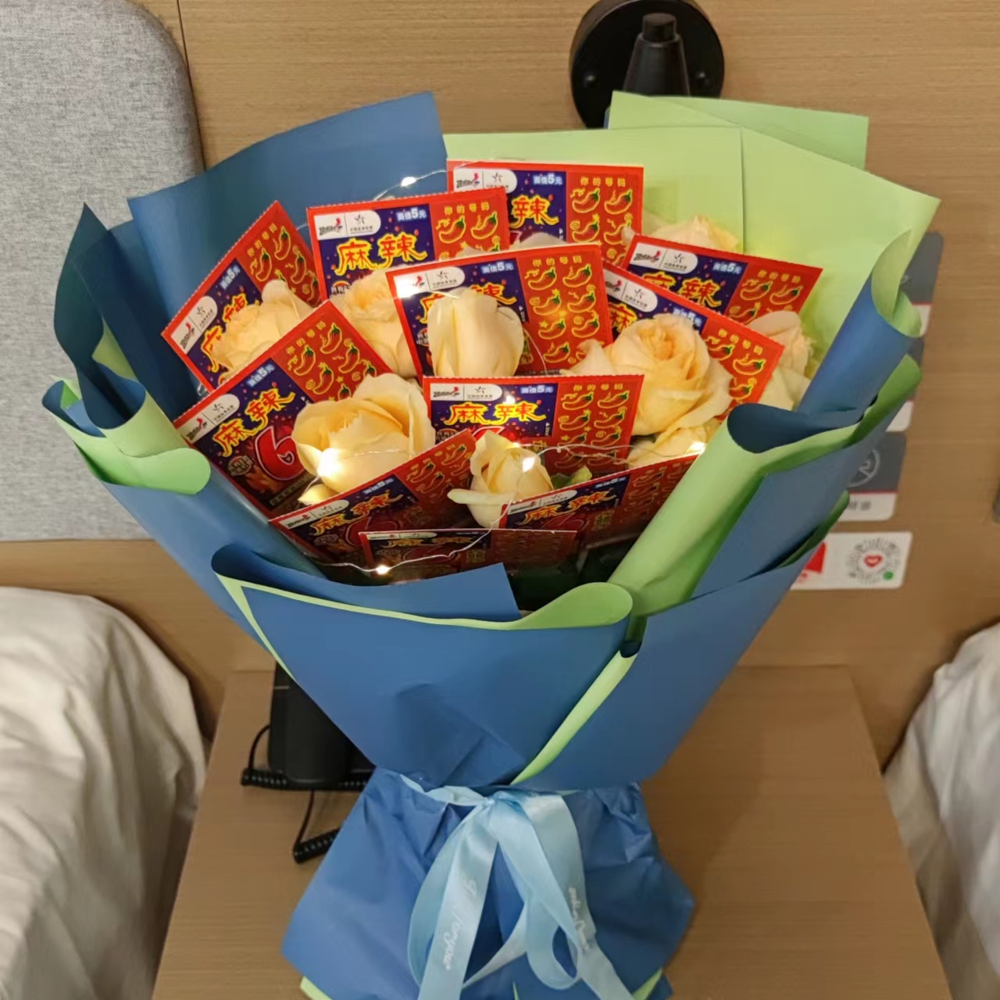

这篇博客从公历新年就计划要写，想对2022年做一个告别。到农历新年还没动键盘。这个周末终于挤出了一点时间来写这篇。

<!-- more -->

其实一边写一边删了很多，主要是删掉了一些比较丧的文字，我不太愿意留下这类东西。但回想起来，22年过的确实比以往任何年都要沮丧一些。

当然也有些快乐的成份。

## 出差

2022年有半年时间我是在外省出差中度过的（另一半是市内出差）。

老板签了一个二次开发项目，客户在山东博兴，要求开发驻场，于是我和另一位同事就被派遣到了博兴。在突然与错愕中的，开始了人生第一次出差。

2月28日6点起床，迷迷糊糊的刷牙洗脸，拎起提前准备好的行李箱，~~背着公司的intel四代酷睿~~笔记本电脑去高铁站。乘高铁到淄博，再从淄博坐大巴到博兴。

### 淄博

能站到淄博还是让我挺激动的，我对淄博充满了期待。因为我那时关注了一个活跃于知乎的博主，朱一旦——一个痴迷于劳力士的“万恶资本家”。他是淄博人，为了宣传家乡还录制并主唱了一首歌叫做《淄加哥》。mv中他手戴劳力士，每个手指都戴着金戒指。歌词的最后一句是“资本家的城市，枯燥且朴实无华”。导致我一直认为淄博是一个面积不大却纸醉金迷的地方。

在淄博站下车后，还没有出站就听到了火车站外饭店放的音乐：

> 西安人的城墙下是西安人的火车

出了车站看到的第一个吃饭的地方是卖西安面和肉夹馍的：

我产生了一种错愕感，我这是到了西安 (⊙_⊙)？（左下角还有个兵马俑立在那里）

火车站旁的白癜风广告让我回忆起，小时候西安火车旁最多的广告就是白癜风和无痛人流。

山东的风真的很大，我觉得住在这里的人完全没必要购置吹风机。

（大风让我没有刘海）

### 博兴

从淄博做大巴到了博兴。去酒店办理入住后，为了不影响第二天去客户公司，又急急忙忙去医院做核酸。等回到酒店瘫在床上时，已经快10点了。

博兴是个县城，隶属山东省滨州市。博兴不是一个旅游地点，却能看到很多外地人。他们大多是因为求职或出差所以过来，博兴作为县城有很不错的经济产出，吸引了很多劳动力。

人口混杂的县城，有很多形形色色的人，和奇奇怪怪的事情。

一次下班在奶茶店等候时，看到街边有人持刀斗殴。几个男女在吃路边小吃（类似烤鱿鱼？），却都默认是对方付钱，结果因为都不愿付钱所以打了起来（人类迷惑行为）。

还遇到特别诚实的烤肉老板：

老板告诉我这的羊肉串是用猪肉做的（所以就是羊肉风味猪肉串）。

### 饮食

说到烤肉，博兴的烤肉是极具特色的：

出差回到家乡后见人就会安利博兴的烤肉，说这是一种极具特色的吃法。

直到同事说：“这不是北京烤鸭的吃法吗？”。

我：“（⊙ｏ⊙）”

因为离海近，这里的海鲜也不错。

饭店也都很实诚，很适合肉食者居住：

哈哈哈，现在想起来在博兴真的吃了好多好吃的。

### 疫情

出差这半年，博兴虽然自始至终没有出现1例阳，但我深深刻刻的感受到了疫情的恐怖。

某天早上正在甲方公司上班，接到酒店的电话，说酒店被征用为隔离酒店了，中午之前就得搬走，否则被隔离人员就要被送来了。我：w(ﾟДﾟ)w

于是和同事两人一起赶回酒店收拾东西，重新找地方住。

和老板电话沟通后，老板说住店的标准是每天在120元已内。我们只好戴着口罩拉着包和箱子，挨家挨户地去各个酒店询问房间及价格。

后来和朋友聊天时，朋友的反应：

非常幸运，找到了一家刚开业的新店，我们以会长期居住为筹码将最便宜的房间从135讲价到了120。住店后发现酒店装修的还挺不错，风格很前沿。之后疫情全面隔离，住在这里是我一年来最幸运的事情。酒店的老板很好，临走前赠送了我酒店的终身会员（尚美）。

在搬到新酒店后的一个月后，区域实施了全面隔离，被迫居酒店办公，吃饭成了很大的问题。

博兴有个很有意思的特点，每条街道都有零食折扣店。疫情期间，几乎所有的店铺都关门了，零食店却可以营业。我们的酒店因为位置隐蔽，可以偷偷跑出去买些零食，不至于没有食物。隔离的这一个月，我们通过零食维持身体所需的energy。每过一周就去采购一大袋。

我和同事采购的伙食

这一个月的隔离，我们将蛋黄酥当饭吃。到后来实在吃不下，太油也太甜了，每天只能吃下一点点。是一种很奇怪的感觉，说不上是饱还是饿。可能是食物摄入少，热量却超了，导致肚子明明没有是空的，看见食物却会恶心。更悲惨的是，因为这些零食的含糖量太高了，虽然我吃的越来越少，但是却胖了😭。

恢复自由后，我几乎戒掉了零食和太甜的饮料~~，虽然后来又恢复了对它们的喜爱~~。

酒店有一处院子，没什么人，不担心被传染，每天中午会搬小板凳在院子里晒晒太阳，是每天的快乐时光。

一个月后解封了。我们第一时间满街到找有没有饭店开门，终于找到了一家鸡公煲店刚刚打开半扇门，各定了一份根本吃不完的豪华版。

虽然这家做的不好吃，但吃到肉的一刻有哭出来的冲动。

### 生活

刚到博兴，在酒店安顿下来后，我意识到我将有很长一段时间住在这里（当时以为是3个月）。我和同事收集讨论附近有什么好玩的，有哪些口碑不错的密室剧本杀，电影院。周边城市有哪些地方可以旅游。我也在思考如何在这里认识新的朋友，提升在这里的生活质量。

然而现实是，之后的全面隔离和无止境的加班，让所有的计划都泡了汤。

每天都加班很晚，只有周日会休息一天，这天通常会用来和同事大吃一顿。扪心自问，我觉得我把博兴的好吃的都吃到了。虽然疫情一个月没饭吃，但之后我对肚子做了足够多的补偿😂。

在博兴度过了一个生日，在加班中度过的，我没有给自己买蛋糕，也没有告诉身边任何人。我太累了，只想快些把该死的工作干完。

令我意外地还是收到了好友送的花。

花送到时，我正在和同事~~挨家试~~吃烤肉。送花的师傅告诉我有11张彩票，放前台了，但没告诉我彩票是插在花里的。我以为我生日礼物就是11张彩票，还在酒店前台的桌子上找了很久。后来意识到，他是担心花里的彩票被人拿走，所以只强调了有彩票😂

周末休息时，有时也会骑着电动车到处逛，这边地共享单车都是电动车，从来没见过恶意毁损的车辆（对比一线城市）。当我把速度开到最快（虽然也没多快），站在踏板上时，我是快乐的。

有天实在无聊，去了趟网吧，回一下大学的游戏生活。完了几局英雄联盟，结果被青铜选手按到了地上摩擦（大学时一直是万年黄金段位）。几年不玩，这游戏怎么就变难了，龙龟怎么就能跳起来了。

### 工作与加班

到甲方公司时，对接的项目经理非常热情，让我对这里的人产生了很不错的印象。

（通行卡）

他们有自己的餐厅与蛋糕房，我对蛋糕房充满了喜爱，经常卖一些奇奇怪怪的糕点。

第一次吃到番茄牛肉馅的月饼ヾ(•ω•`)o

之后是为期几天的需求对接。

我们出发到博兴前，手上有老板发来的两页需求。我们带着这两页需求来到了博兴。而经过几天的需求讨论，我们亲眼看着需求一页页增加。从2页纸，变成3页4页，最后变成了一本册子，项目经理甚至装订并套上了塑料封皮。我看到需求纸变成需求册后整个人不知所措。项目经理问我：“你们才来两个人，能做完吗？”

向领导汇报情况后，公司考虑成本没有增派人员的打算，我明白之后的几个月应该是要天天加班了。原本计划和同事在清明节和五一去旅游，都被安排了加班。连中秋节也在通宵上线。

在为期半年的合作中，甲方展现出了远超我们的专业程度及职业素养：

1. 需求明确。所有需求说明及需求变更全部成为纸质文件，并由业务负责人员签字，我们不需要承认任何口头需求。这真的是帮了我们的大忙，至少节约了我们两月的工作。
2. 协调多方专家提供建议。遇到非软件开发的问题（像服务架构、文件迁移及备份方案），可以协调到多方资源。他人擅长的专业领域有时候会弥补我们的认知盲点，对我们产生新的启发，相互取长补短。
3. 资源的快速协调，服务器、vpn、f5这些需要甲方提供的资源，甲方从来没有拖延过，也没有遇到任何端口不通的到琐事。需要的资源当天就会得到响应，我能看到他们是尊重我们的时间的。
4. 还是尊重。尊重会体现在各方各面，但我觉得最直观的表现是，对方不浪费我的时间。对一个技术人来说，最大的尊重应该就是对方不浪费他的时间。

之后就是日日夜夜的加班了，这个没有什么好讲的，苦恼多于快乐。

甲方的班车24小时都有，但是夜间班车是不开灯的，只有到站才亮一下，不知道是不是为了照顾在车上休息的人（坐过站怎么办）。我们有了半年坐黑漆漆班车的体验。

班车灯熄了，乘客也就不说话了。就很神奇，大部分乘客在灯灭后，就会变的静悄悄。

我还是没有忍住，在黑漆漆中问同事：“为什么我们就要这么辛苦？”

## 回家

项目做完，就回家了。

### 继续加班

回家后就上班了，马上投入到了新的项目，甲方是家银行。

在紧张的需求梳理后，领导告知下周要上线。我：？？？？

因为没有像样的需求说明书，只好和同事去银行面对面对接需求。

客户：怎么才做了这一点？╰（‵□′）╯

我：我才刚回西安知道有这个项目呀。

客户：可你领导三周前就告诉我已经在开发中了呀。╰（‵□′）╯                                                                                                                                                                                                                                                                                                                                                                                                                                                                                                                                                                                                                                                                                                                                                                                                                                                                                                                                                                                                                                                                                                                                                                                                                                                                                                                                                                                                                                                                                                                                                                                                                                                    

我：？？？？

客户：你们才两个人，能做完吗？

难怪需求还没对完就要被催着上线。我明白我又要开始加班了，事实没有辜负我的判断。

再后来又接了新项目，开启了全周无休的无止境的加班。

除了工作与睡觉，我再没有任何任何个人生活。加班成了每天的主旋律，回到家就到睡觉的时候了，甚至更晚。我告诉自己看10分钟手机就睡觉，但通常不会真的只看10分钟手机。即使明知第二天会顶着黑眼圈上班、会困倦、会流失肌肉、损伤记忆，但还是不能做到马上倒头就睡觉。因为心里会感觉到如果不让自己快乐些，会对不起忙碌了一天的自己，而手机是我唯一能想到可以让我快速找到快乐的东西（其实并不能）。

这周破天荒的因为元宵节周末没有加班，我有了时间写这篇很早就计划要写的博客。

## 关于加班的思考

加了一整年的班，我对加班有了自己的认知：

- **它严重的影响了我的身体和心理健康。**
- **它使我没有时间为自己考虑，积累知识、技能、经验和成果。阻碍我个人长久的事业。**
- 它使我全部的时间被困在岗位，没有社交，失去了遇到好机遇的机会。
- 它使我失去了夜生活，错过了陪伴家人朋友这种不可逆的时光。
- 没有加班费的加班使我的时薪降大幅降低，远低于其它技能要求更低的职位，让我变得不值钱。
- 不固定的加班，使我无法安排自己的时间，不敢答应约会或私活，或者被迫更改已有计划。

**选择工作，就是选择一种生活方式，而加班是最愚蠢的那种。**

如果以后有计划换工作，我觉得一定会将加班情况作为最关注的点：

1. 公司平时加班吗？
2. 加班有没有加班费？加班费按照什么标准发放？
3. 有没有其它的补助，有没有加班额外餐补，几点后可以报销打车费。
4. 员工可不可以使用自己的笔记本电脑及外设。也许有公司配备不错的电脑，但我一定愿意购买更好的。只有自己才珍惜自己的时间，更好的电脑节约下来的每一分钟时间都是自己用来学习与提升的时间。
5. **如果我接受了这份工作，我的时薪算下来是多少？比上份工作多了多少？**

只要能确定有按照劳动法的1.5倍加班费，以及一个还不错的底薪，其实就差不多了。有13、14薪更好，年终奖是不靠谱的，我连续两年没有发了(○´･д･)ﾉ

总的来说，时薪因该是衡量工作好坏的最总要指标，而国内大部分的加班会降低你的时薪。

电脑是个很神奇的槽点。我目前工作80%的工作时间浪费来自于电脑太卡，每个人都对公司的电脑深恶痛绝。而公司不换电脑的态度很坚决，且不允许员工自备电脑，这是让我从入职以来就匪夷所思的一点。无论站在个人还是公司的利益点来看，我都无法理解一家软件公司在2023年还在让开发者使用2013生产的i5低压笔记本是出于哪方面考虑。

## 结语

刚毕业时，我一心的梦想都是尽早实现财务自由，然后去周游世界，去冒险。

后来就只想“好好地活着”。即便是以这个摆烂的标准来看，我因该是也没有达到。我很难将现在几乎没有个人生活的生活理解为“好好地活着”。

一旦目标变得平庸，我连平庸的目标也变得难以实现。

今年的愿望，是摆脱加班。交一些朋友，让自己快乐一些。做一些属于自己的事情，如果这些事还能让我赚到钱就太棒了。