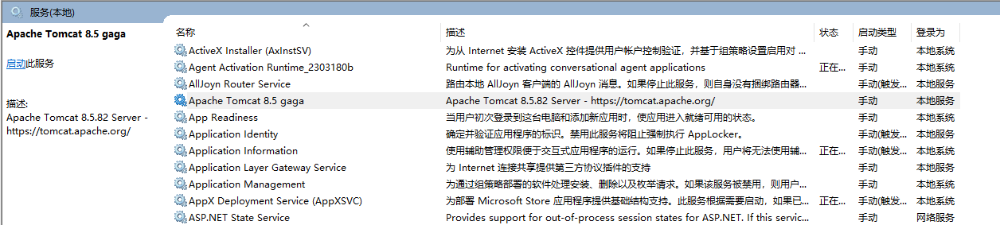
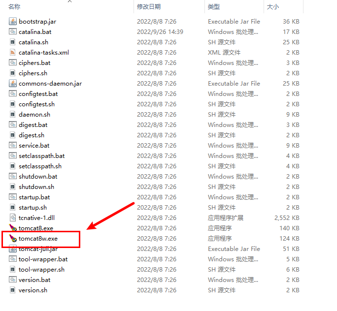
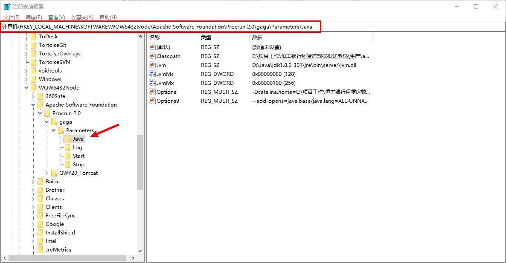

当我最不喜欢的两个事物组合在了一起。

<!-- more -->

之所以我会需要搞清楚这些，是因为：

1. 这个项目因为某些外在原因，需要部署在windows服务器。

2. 我们需要部署多个应用，但只能有一个端口:smiley:。

想来想去，除了使用tomcat还想没有更好的解决思路。

## 你可能想要改的配置

### windows环境修改tomcat控制台字符编码

这个问题的原因是windows在中文环境中，cmd的默认编码集为GBK，与tomcat的字符编码不一致，所以导致tomcat的命令框和输出日志都是乱码。这是windows的锅，准确说和tomcat没什么关系，但为了不影响其它系统运行，相对于修改windows配置，最保守的解决办法是修改我们自己tomcat。

修改 `tomcat\conf\logging.properties` ：

```properties
java.util.logging.ConsoleHandler.level = FINE
java.util.logging.ConsoleHandler.formatter = org.apache.juli.OneLineFormatter
java.util.logging.ConsoleHandler.encoding = GBK
```

据说在jvm参数增加 `-Dfile.encoding=UTF-8` 也是可以的。

### 注册为服务

使用安装包版的tomcat会自动安装一个服务，使得tomcat可以在后台运行。可是如果遇到和我同样的情形，就需要自己注册tomcat服务了。

我们在使用的服务器不止我们在用，还有其它公司的项目，也许其他人也要使用tomcat，这台机器可能不止运行一个tomcat。而通过安装包，我们只能得到一个服务。并且为了区分这个服务是我们的，所以我们得给它起名。

::: tip

提到windows服务，人们总会想到winsw。但我试了，它不行。它所封装的服务总会提示服务运行失败，然而实际上却在后台运行成功了。服务页面显示的状态并不能反映真实的应用运行状态，以至于不得不以非正常途径关闭它。

:::

tomcat有一个用于注册服务的工具 `service.bat`。我们可以通过它注册一个服务：

```shell
$ .\service.bat install gaga
Neither the Tomcat8.exe file nor the gaga.exe file was found...
Either the CATALINA_HOME environment variable is not defined correctly or
the incorrect service name has been used.
Both the CATALINA_HOME environment variable and the correct service name
are required to run this program.
```

噢，这台电脑有配置环境变量 `CATALINA_HOME` ，但却配置的不是我们的tomcat路径。我们可以配置成我们tomcat的根目录，或者直接删掉这个环境变量。(在 `service.bat` 文件中，我们可以看到，它会先在环境变量找`CATALINA_HOME` ，找不到才使用相对路径。

或者为了不影响别人的tomca，可以将startup.bat 、shutdown.bat、catalina.bat、service.bat中的 `CATALINA_HOME` 全部改成指定路径。（救命...）

再来（改完环境变量记得要重开控制台）：

```shell
$ .\service.bat install gaga
Installing the service 'gaga' ...
Using CATALINA_HOME:    "E:\path\apache-tomcat-8.5.82"
Using CATALINA_BASE:    "E:\path\apache-tomcat-8.5.82"
Using JAVA_HOME:        "D:\Java\jdk1.8.0_301"
Using JRE_HOME:         "D:\Java\jdk1.8.0_301\jre"
Using JVM:              "D:\Java\jdk1.8.0_301\jre\bin\server\jvm.dll"
The service 'gaga' has been installed.
```

这下就有这个叫gaga的服务了。



卸载服务也很简单：

```shell
.\service.bat remove gaga
```

### 修改jvm参数

提到修改tomcat运行时的jvm参数，大家总会想到 `catalina.bat` 。但其实如果不是通过 `startup.bat` 启动，`catalina.bat` 这个文件是不经过的。tomcat：你随便改，我变算我输。

其实官方也有专门用来配置服务的工具：



然而它只能修改名叫“tomcat8”的tomcat服务，我......

好像也可以通过把"tomcat8.exe"和"tomcat8w.exe"改名成"gaga.exe"和"gagaw.exe"解决...真这样做就很一言难尽。

#### 使用注册表编辑器

推荐使用这种方式修改jvm参数：

1. 快捷键按 `win+r` 弹出运行窗口输入 `regedit` 进入注册表编辑器。

2. 打开这个路径：
   

3. 肆意修改吧，少年。（tips：修改内存大小时记得选择十进制，如果你不想考验自己的算数水平）

勇敢去吧，少年！
