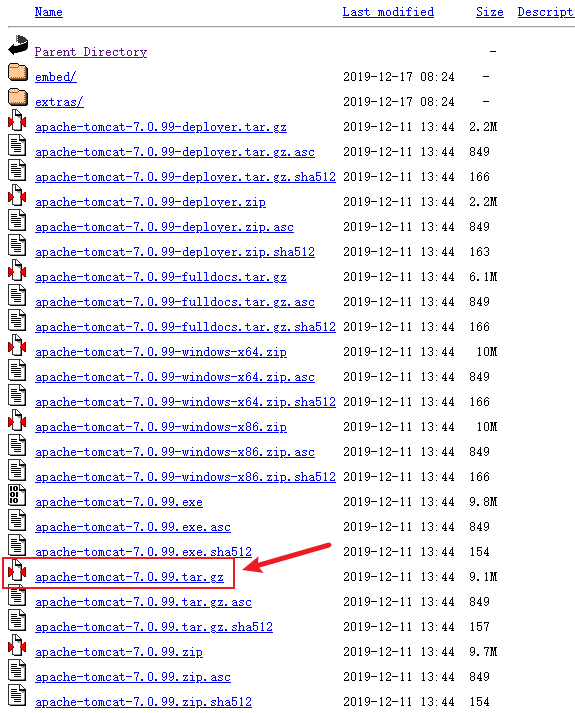

## 安装JDK

### 下载

当前最新版本下载地址：

[http://www.oracle.com/technetwork/java/javase/downloads/index.html](http://www.oracle.com/technetwork/java/javase/downloads/index.html)

历史版本下载地址：　　

[https://www.oracle.com/java/technologies/downloads/archive/](https://www.oracle.com/java/technologies/downloads/archive/)

可下载rpm安装包与tar.gz压缩包，我在这里**选择使用tar.gz**。

### 解压

```shell
$ tar -zxvf jdk-7u80-linux-x64.tar.gz -C /usr/local/
```

:::warning

一定需要通过压缩包解压，而不是直接将解压过的文件夹复制过来，否则bin下的文件会没有可执行权限。

:::

### 配置环境变量

在 `/etc/profile` 进行环境变量配置，我这里使用Xftp工具打开，直接用vscode进行编辑的。

编写位置在文件最下方，应在 `unset -f pathmunge` 之下。

```shell
# java environment
export JAVA_HOME=/usr/local/java/jdk1.7.0_80
export CLASSPATH=.:${JAVA_HOME}/jre/lib/rt.jar:${JAVA_HOME}/lib/dt.jar:${JAVA_HOME}/lib/tools.jar
export PATH=$PATH:${JAVA_HOME}/bin
```

配置完毕后是这个样子：


（`export TMOUT=300` 是我的服务器自带的，我看别人的好像没有）

编辑完毕，使用 `source /etc/profile` 命令使配置文件生效。

### 验证

正确的显示应如下：

```shell
$ java -version
java version "1.7.0_80"
Java(TM) SE Runtime Environment (build 1.7.0_80-b15)
Java HotSpot(TM) 64-Bit Server VM (build 24.80-b11, mixed mode)
```


## 安装Tomcat

当前最新版本下载地址：

[https://tomcat.apache.org/](https://tomcat.apache.org/)

历史版本下载地址：

[https://archive.apache.org/dist/tomcat/](https://archive.apache.org/dist/tomcat/)

下载历史版本时，安装包在bin目录下：


下载以tar.gz为后缀的版本：



### 解压

```shell
$ tar -zxvf apache-tomcat-7.0.99.tar.gz -C /usr/local/
```

### 配置开机自启

在 `/etc/rc.d/rc.local` 文件最后加上：

```
export JAVA_HOME=/usr/local/java/jdk1.7.0_80
/usr/local/apache-tomcat-7.0.99/bin/startup.sh start
```

说明：

- `/usr/local/java/jdk1.7.0_80` 是jdk安装目录
- `/usr/local/apache-tomcat-7.0.99` 是tomcat安装的目录

修改rc.local文件为可执行

```shell
chmod +x  rc.local  
```

::: tip

重启服务器命令是 `reboot` 。

:::

完毕，撒花！:tada:


## 安装OpenOffice

### 下载

[https://www.openoffice.org/download/](https://www.openoffice.org/download/)


下载完毕传输到服务器即可。

### 安装

```shell
# 解压
$ tar -zxvf Apache_OpenOffice_4.1.11_Linux_x86-64_install-rpm_zh-CN.tar.gz 
# 进入RPMS目录，其中有一堆rpm和一个叫desktop-integration文件夹
$ cd ./zh-CN/RPMS/
# 一口气将RPMS目录下的rpm全安装了
$ yum install -y *.rpm
# 再装desktop-integration下的rpm
$ cd desktop-integration/
$ yum install -y openoffice4.1.11-redhat-menus-4.1.11-9808.noarch.rpm
```

安装成功后会在/opt下出现一个openoffice4文件。

### 运行

临时启动

```shell
$ /opt/openoffice4/program/soffice -headless -accept="socket,host=127.0.0.1,port=8100;urp;" -nofirststartwizard
```

后台启动

```shell
$ /opt/openoffice4/program/soffice -headless -accept="socket,host=127.0.0.1,port=8100;urp;" -nofirststartwizard &
```

查看启动状态：

```shell
# 方式1
$ netstat -lnp | grep 8100
# 方式2
$ ps -ef | grep soffice
```

::: tip

如果启动时出现：

```shell
$ /opt/openoffice4/program/soffice -headless -accept="socket,host=127.0.0.1,port=8100;urp;" -nofirststartwizard
/opt/openoffice4/program/soffice.bin: error while loading shared libraries: libXext.so.6: cannot open shared object file: No such file or directory
```

这个是找不到 `libXext.so.6` 文件。去系统里面的 `/usr/lib64` 中或者 `/usr/lib` ，查看有没有这个文件。

如果没有，需要先安装：`yum install libXext.x86_64` （64位） 或 `yum install libXext.i686` （32位）。

将 `libXext.so.6` copy到 `/opt/openoffice4/program/` 目录里面，并赋予 `chmod 777` 权限 。

```shell
$ yum install -y libXext.x86_64
$ cp /usr/lib64/libXext.so.6 /opt/openoffice4/program/
$ chmod 777 /opt/openoffice4/program/libXext.so.6
```

:::

::: tip

如果启动时提醒 `no suitable windowing system found, exiting`, 需要：

```shell
$ yum groupinstall -y "X Window System"
```

:::

### 配置开机自启

在 `/etc/rc.d/rc.local` 中添加：

```
/opt/openoffice4/program/soffice -headless -accept="socket,host=127.0.0.1,port=8100;urp;" -nofirststartwizard &
```

确保或修改rc.local文件为可执行

```shell
chmod +x rc.local  
```

### 卸载

```shell
$ rpm -e `rpm -qa |grep openoffice` `rpm -qa |grep ooobasis`
```


