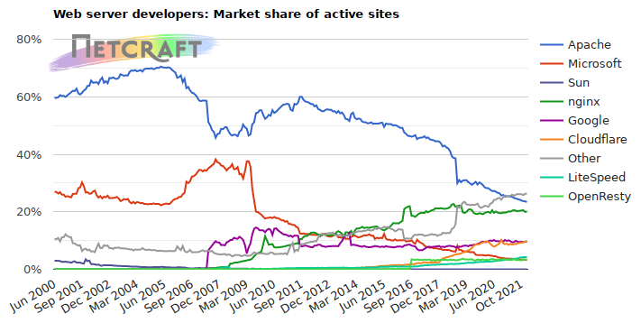
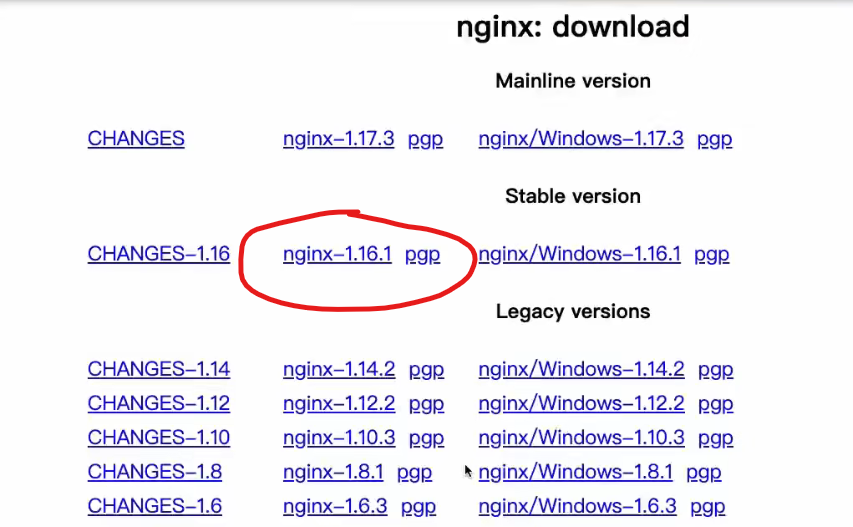

## 集群

集群的优点：

1. 提升性能、并发量。集群可以将流量分发到各个节点，以提高整个系统的性能。
2. 提高系统可用性，避免像单体项目一旦宕机就无法提供服务。
3. 可伸缩。根据流量调整增加或减少节点。

FBI Warning：

在搭建集群时，我么需要关注：

1. 会话需要考虑分布式会话。
2. 定时任务要作为独立节点，我们应避免多个节点同时跑一模一样的定时任务。定时任务应单独做成一个服务。
3. 内网要互通。

## Nginx？yes！

Nginx (engine x) 是一个高性能的HTTP和反向代理web服务器，同时也提供了IMAP/POP3/SMTP服务。Nginx是由伊戈尔·赛索耶夫为俄罗斯访问量第二的Rambler.ru站点（俄文：Рамблер）开发的，第一个公开版本0.1.0发布于2004年10月4日。

主要功能：

1. 反向代理、通过配置文件实现集群和负载均衡
2. 静态资源虚拟化

nginx及其它服务器受欢迎程度的趋势：



图片来源：[https://news.netcraft.com/](https://news.netcraft.com/)

## 反向代理

先说说正向代理，我们用过或听过的vpn就是正向代理服务器。我们访问某个网站，可这个网站基于某些原因不为我们提供服务，这时就可以使用vpn，我们将请求发送给vpn提供商，vpn提供商就是我们的代理，帮我们来传达请求，以得到正常的服务。**在正向代理过程中，网站只能接触到vpn提供商，并不知道我们的真实身份。**

而返现代理，是指用户访问网站的代理服务器，由代理服务器来决定转发到哪个服务节点。**在反向代理过程中，我们只知道代理服务器的地址，并不知道服务器的真实节点。**

## 下载安装

nginx.org下载下面这个版本



安装依赖：

```shell
# 安装依赖环境
yum install gcc-c++
# 安装PCRE库，用于解析正则表达式
yum install -y pcre pcre-devel
# zlib 压缩与解压缩
yum install -y zlib zlib-devel
# SSL 安全的、加密的套接字协议层，用于HTTP安全传输，也就是HTTPS
yum install -y openssl openssl-devel
```

解压：

```shell
tar -zxvf nginx-1.16.1.tar.gz
```

编译之前要创建nginx临时目录，如果不创建、在启动nginx过程中会报错

```shell
mkdir /var/temp/nginx -p
```

在nginx目录执行配置：

```shell
./configure \
--prefix=/usr/local/nginx \
--pid-path=/var/run/nginx/nginx.pid \
--lock-path=/var/lock/nginx.lock \
--error-log-path=/var/log/nginx/error.log \
--http-log-path=/var/log/nginx/access.log \
--with-http_gzip_static_module \
--http-client-body-temp-path=/var/temp/nginx/client \
--http-proxy-temp-path=/var/temp/nginx/proxy \
--http-fastcgi-temp-path=/var/temp/nginx/fastcgi \
--http-uwsgi-temp-path=/var/temp/nginx/uwsgi \
--http-scgi-temp-path=/var/temp/nginx/scgi
```

具体说明：

- `--prefix` 选项是配置安装的路径，如果不配置该选项，安装后可执行文件默认放在/usr/local/bin，库文件默认放在/usr/local/lib，配置文件默认放在/usr/local/etc，其它的资源文件放在/usr/local/share，比较凌乱。

  如果配置 `--prefix` ，如：`./configure --prefix=/usr/local/test` 可以把所有资源文件放在/usr/local/test的路径中，不会杂乱。

  用了 `—prefix` 选项的另一个好处是卸载软件或移植软件。当某个安装的软件不再需要时，只须简单的删除该安装目录，就可以把软件卸载得干干净净；移植软件只需拷贝整个目录到另外一个机器即可（相同的操作系统）。当然要卸载程序，也可以在原来的make目录下用一次 `make uninstall` ，但前提是make文件指定过 `uninstall` 。

- 


如果成功产生makefile配置文件，执行make命令即可编译

make install即可安装

## 基本操作

- `./neginx -t` 测试文件正确性

- `./nginx` 开启
-  `./nginx -s stop` 停止

- `./nginx -s reload` 重新加载

